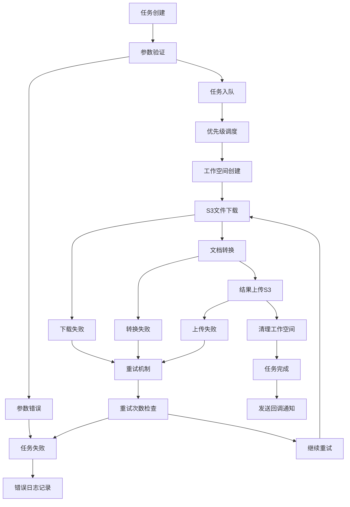
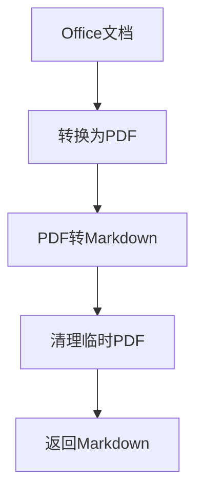
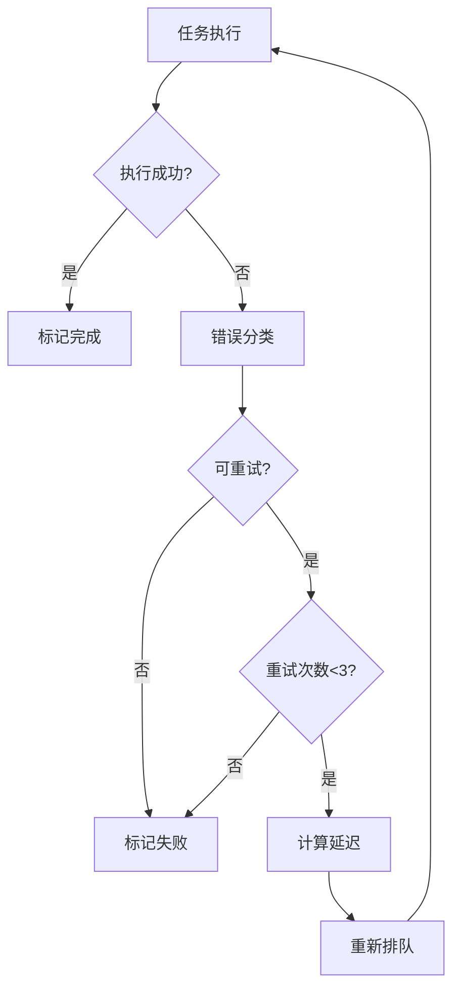

# 任务处理完整指南

本文档详细描述了文档转换服务的任务处理流程，包括系统架构、处理流程、API接口和技术实现细节。本指南适用于开发者、运维人员和系统集成人员。

## 📖 文档概览

- **系统架构**: 核心组件和队列系统设计
- **任务生命周期**: 从创建到完成的完整流程
- **处理阶段**: 详细的执行步骤和技术实现
- **错误处理**: 重试机制和故障恢复
- **监控运维**: 性能指标和故障排除
- **最佳实践**: 优化建议和使用技巧

## 🏗️ 系统架构概览

### 核心组件

1. **API服务器** (`main.py` + `api/unified_document_api.py`)
   - 基于FastAPI框架，支持异步处理
   - 提供REST API接口和Swagger文档
   - 支持文件上传、任务管理和批量操作
   - 集成CORS中间件和错误处理
   - 支持健康检查和系统监控

2. **增强任务处理器** (`processors/enhanced_task_processor.py`)
   - 异步任务调度引擎，支持多线程并发
   - 多队列管理系统（优先级队列、处理队列、回调队列）
   - 智能重试机制和错误恢复
   - 实时任务状态更新和进度跟踪
   - 资源管理和工作空间清理

3. **文档转换服务** (`services/document_service.py`)
   - 集成LibreOffice（Office转PDF）和MinerU 2.0（PDF转Markdown）
   - 提供统一的文档转换接口
   - 支持批量处理和参数化配置
   - GPU加速支持和内存优化
   - 多格式支持和质量控制

4. **存储服务** (`services/s3_*_service.py`)
   - S3下载服务：从云存储下载输入文件，支持断点续传
   - S3上传服务：上传转换结果到云存储，支持多文件上传
   - 支持AWS S3、MinIO等兼容存储
   - 智能路径解析和文件组织
   - 存储配额管理和清理策略

5. **Web界面** (`gradio_app.py`)
   - 基于Gradio的用户友好界面
   - 支持文件拖拽上传和实时预览
   - 任务状态可视化和进度监控
   - 批量操作和历史记录管理

### 队列系统架构

任务处理器采用多队列架构，实现高效的任务调度和资源管理：

```
┌─────────────────┐    ┌─────────────────┐    ┌─────────────────┐
│   fetch_queue   │────│ priority_queues │────│ processing_queue│
│   (待获取任务)   │    │ (优先级调度)     │    │   (任务处理)     │
└─────────────────┘    └─────────────────┘    └─────────────────┘
         │                       │                       │
         │                       │                       │
┌─────────────────┐    ┌─────────────────┐    ┌─────────────────┐
│  update_queue   │    │  cleanup_queue  │    │ callback_queue  │
│  (状态更新)      │    │   (资源清理)     │    │   (回调通知)     │
└─────────────────┘    └─────────────────┘    └─────────────────┘
```

**队列详细说明**：
- **fetch_queue**: 待获取任务队列，从数据库拉取新任务
- **high_priority_queue**: 高优先级任务队列（urgent/high，<5分钟处理）
- **normal_priority_queue**: 普通优先级任务队列（normal，<30分钟处理）
- **low_priority_queue**: 低优先级任务队列（low，<2小时处理）
- **task_processing_queue**: 任务处理队列，执行实际转换工作
- **update_queue**: 状态更新队列，异步更新任务状态到数据库
- **cleanup_queue**: 清理队列，清理临时文件和工作空间
- **callback_queue**: 回调队列，发送任务完成通知

**队列性能参数**：
- 最大队列长度：1000个任务
- 工作线程数：4个（可配置）
- 队列检查间隔：1秒
- 批量处理大小：10个任务/批次

## 🔄 任务生命周期详解

### 任务状态枚举
| 状态 | 描述 | 可转换状态 | 持续时间 |
|------|------|------------|----------|
| `pending` | 等待处理 | `processing`, `failed` | 通常<30秒 |
| `processing` | 正在处理 | `completed`, `failed` | 1-10分钟 |
| `completed` | 处理完成 | - | 永久状态 |
| `failed` | 处理失败 | `pending` (重试) | 可重试3次 |

### 任务优先级系统
| 优先级 | 值 | 处理时间 | 使用场景 |
|--------|----|---------|---------|
| `urgent` | 4 | <5分钟 | 紧急文档转换 |
| `high` | 3 | <15分钟 | 重要业务文档 |
| `normal` | 2 | <30分钟 | 常规文档处理 |
| `low` | 1 | <2小时 | 批量处理任务 |

### 完整处理流程



### 任务处理时间估算

| 任务类型 | 文件大小 | 预估时间 | 资源消耗 |
|----------|----------|----------|----------|
| PDF转Markdown | <10MB | 30-60秒 | CPU密集 |
| PDF转Markdown | 10-50MB | 1-3分钟 | GPU加速 |
| Office转PDF | <10MB | 10-30秒 | IO密集 |
| Office转PDF | 10-50MB | 30-90秒 | 内存密集 |
| Office转Markdown | <10MB | 40-90秒 | 混合处理 |
| 批量处理 | 10个文件 | 5-15分钟 | 并发处理 |

## 📋 详细处理阶段

### 1. 任务创建阶段

#### 1.1 API请求接收
```http
POST /api/tasks/create
Content-Type: multipart/form-data

task_type=pdf_to_markdown
bucket_name=documents
file_path=reports/annual_report.pdf
platform=your-platform
priority=high
parameters={"table_recognition": true, "formula_recognition": true}
callback_url=https://your-domain.com/webhook/task-complete
```

**支持的请求参数**：
- `task_type`: 任务类型（必需）
- `bucket_name`: S3存储桶名称（必需）
- `file_path`: 文件路径（必需）
- `platform`: 平台标识（可选）
- `priority`: 任务优先级（可选，默认normal）
- `parameters`: 转换参数（可选，JSON格式）
- `callback_url`: 回调URL（可选）
- `batch_name`: 批次名称（批量任务时使用）

#### 1.2 参数验证

**基础参数验证**：
- **task_type**: 验证是否为支持的类型（pdf_to_markdown, office_to_pdf, office_to_markdown等）
- **bucket_name**: 验证S3存储桶名称格式（3-63字符，小写字母数字和连字符）
- **file_path**: 验证文件路径格式（不能包含../等危险字符）
- **priority**: 验证优先级值（urgent, high, normal, low）

**高级参数验证**：
- **parameters**: JSON格式验证和参数范围检查
- **callback_url**: URL格式验证和域名白名单检查
- **file_size**: 文件大小限制检查（最大100MB）
- **file_format**: 文件格式支持性检查

**验证失败处理**：
```python
# 参数验证示例
if task_type not in SUPPORTED_TASK_TYPES:
    raise HTTPException(status_code=400, detail=f"Unsupported task type: {task_type}")

if not re.match(r'^[a-z0-9][a-z0-9-]*[a-z0-9]$', bucket_name):
    raise HTTPException(status_code=400, detail="Invalid bucket name format")
```

#### 1.3 任务对象创建
```python
# 创建任务对象
task = DocumentTask(
    task_id=str(uuid.uuid4()),  # 生成唯一任务ID
    task_type="pdf_to_markdown",
    bucket_name="documents",
    file_path="reports/annual_report.pdf",
    platform="your-platform",
    priority="high",
    status="pending",
    parameters={
        "table_recognition": True,
        "formula_recognition": True,
        "extract_images": True
    },
    callback_url="https://your-domain.com/webhook",
    created_at=datetime.utcnow(),
    updated_at=datetime.utcnow(),
    retry_count=0,
    max_retries=3,
    estimated_duration=120  # 预估处理时间（秒）
)

# 保存到数据库
await task_manager.create_task(task)

# 添加到处理队列
await task_processor.enqueue_task(task)
```

**任务ID生成规则**：
- 使用UUID4确保全局唯一性
- 格式：`xxxxxxxx-xxxx-4xxx-yxxx-xxxxxxxxxxxx`
- 用于任务跟踪和状态查询

### 2. 任务调度阶段

#### 2.1 优先级队列调度
```python
# 智能调度算法
async def _priority_scheduler_worker(self):
    while self.is_running:
        try:
            # 优先级调度策略
            task = None
            
            # 1. 紧急任务优先（urgent）
            if not self.urgent_queue.empty():
                task = await asyncio.wait_for(self.urgent_queue.get(), timeout=0.1)
                logger.info(f"Processing urgent task: {task.task_id}")
            
            # 2. 高优先级任务（high）
            elif not self.high_priority_queue.empty():
                task = await asyncio.wait_for(self.high_priority_queue.get(), timeout=0.1)
                logger.info(f"Processing high priority task: {task.task_id}")
            
            # 3. 普通优先级任务（normal）
            elif not self.normal_priority_queue.empty():
                task = await asyncio.wait_for(self.normal_priority_queue.get(), timeout=0.1)
                logger.info(f"Processing normal priority task: {task.task_id}")
            
            # 4. 低优先级任务（low）
            elif not self.low_priority_queue.empty():
                task = await asyncio.wait_for(self.low_priority_queue.get(), timeout=0.1)
                logger.info(f"Processing low priority task: {task.task_id}")
            
            if task:
                # 更新任务状态为processing
                await self._update_task_status(task, "processing")
                
                # 添加到处理队列
                await self.task_processing_queue.put(task)
                
                # 记录调度指标
                self.metrics['tasks_scheduled'] += 1
                self.metrics['queue_wait_time'] = time.time() - task.created_at.timestamp()
            
            else:
                # 没有任务时短暂休眠
                await asyncio.sleep(0.1)
                
        except asyncio.TimeoutError:
            # 队列为空，继续循环
            continue
        except Exception as e:
            logger.error(f"Priority scheduler error: {e}")
            await asyncio.sleep(1)
```

#### 2.2 工作线程分配

**线程池管理**：
```python
class TaskProcessor:
    def __init__(self, max_workers=4):
        self.max_workers = max_workers
        self.active_workers = 0
        self.worker_semaphore = asyncio.Semaphore(max_workers)
        self.worker_stats = {
            'total_processed': 0,
            'success_count': 0,
            'error_count': 0,
            'average_processing_time': 0
        }
    
    async def _task_worker(self, worker_id: int):
        """工作线程主循环"""
        logger.info(f"Worker {worker_id} started")
        
        while self.is_running:
            try:
                # 获取信号量（限制并发数）
                async with self.worker_semaphore:
                    # 从处理队列获取任务
                    task = await self.task_processing_queue.get()
                    
                    if task is None:  # 停止信号
                        break
                    
                    self.active_workers += 1
                    start_time = time.time()
                    
                    try:
                        # 执行任务处理
                        await self._process_single_task(task)
                        
                        # 更新成功统计
                        self.worker_stats['success_count'] += 1
                        
                    except Exception as e:
                        logger.error(f"Worker {worker_id} task {task.task_id} failed: {e}")
                        self.worker_stats['error_count'] += 1
                        
                        # 添加到重试队列
                        await self._handle_task_retry(task, str(e))
                    
                    finally:
                        # 更新处理时间统计
                        processing_time = time.time() - start_time
                        self._update_processing_stats(processing_time)
                        
                        self.active_workers -= 1
                        self.worker_stats['total_processed'] += 1
                        
                        # 标记任务完成
                        self.task_processing_queue.task_done()
                        
            except asyncio.CancelledError:
                logger.info(f"Worker {worker_id} cancelled")
                break
            except Exception as e:
                logger.error(f"Worker {worker_id} unexpected error: {e}")
                await asyncio.sleep(1)
        
        logger.info(f"Worker {worker_id} stopped")
```

**负载均衡策略**：
- 动态调整工作线程数量
- 基于CPU和内存使用率的自适应调度
- 任务类型优化分配（CPU密集型 vs IO密集型）

### 3. 任务执行阶段

#### 3.1 工作空间管理

**工作空间创建**：
```python
import tempfile
import shutil
from pathlib import Path

class WorkspaceManager:
    def __init__(self, base_dir="/tmp/document_convert"):
        self.base_dir = Path(base_dir)
        self.base_dir.mkdir(exist_ok=True)
    
    async def create_workspace(self, task_id: str) -> Path:
        """为任务创建独立工作空间"""
        workspace_dir = self.base_dir / f"task_{task_id}"
        
        try:
            # 创建工作目录结构
            workspace_dir.mkdir(exist_ok=True)
            (workspace_dir / "input").mkdir(exist_ok=True)
            (workspace_dir / "output").mkdir(exist_ok=True)
            (workspace_dir / "temp").mkdir(exist_ok=True)
            
            # 设置权限
            workspace_dir.chmod(0o755)
            
            logger.info(f"Created workspace: {workspace_dir}")
            return workspace_dir
            
        except Exception as e:
            logger.error(f"Failed to create workspace for task {task_id}: {e}")
            raise
    
    async def cleanup_workspace(self, task_id: str, keep_output=False):
        """清理工作空间"""
        workspace_dir = self.base_dir / f"task_{task_id}"
        
        try:
            if workspace_dir.exists():
                if keep_output:
                    # 只删除输入和临时文件
                    shutil.rmtree(workspace_dir / "input", ignore_errors=True)
                    shutil.rmtree(workspace_dir / "temp", ignore_errors=True)
                else:
                    # 删除整个工作空间
                    shutil.rmtree(workspace_dir, ignore_errors=True)
                
                logger.info(f"Cleaned workspace for task {task_id}")
                
        except Exception as e:
            logger.error(f"Failed to cleanup workspace for task {task_id}: {e}")
```

**环境变量配置**：
```python
def setup_task_environment(workspace_dir: Path, task: Task) -> dict:
    """设置任务执行环境"""
    env_vars = {
        'TASK_ID': task.task_id,
        'WORKSPACE_DIR': str(workspace_dir),
        'INPUT_DIR': str(workspace_dir / "input"),
        'OUTPUT_DIR': str(workspace_dir / "output"),
        'TEMP_DIR': str(workspace_dir / "temp"),
        'PYTHONPATH': os.environ.get('PYTHONPATH', ''),
        'PATH': os.environ.get('PATH', ''),
    }
    
    # 添加任务特定配置
    if task.parameters:
        for key, value in task.parameters.items():
            env_vars[f'TASK_PARAM_{key.upper()}'] = str(value)
    
    return env_vars
```

**日志示例**:
```
2025-08-09 19:38:35 - utils.workspace_manager - INFO - Created task workspace: /app/task_workspace/task_123
```

#### 3.2 S3文件下载

**文件下载实现**：
```python
import aiofiles
import hashlib
from minio import Minio
from minio.error import S3Error

class S3FileManager:
    def __init__(self, minio_client: Minio):
        self.client = minio_client
    
    async def download_file(self, bucket_name: str, file_path: str, 
                          local_path: Path, task_id: str) -> dict:
        """从S3下载文件到本地"""
        download_info = {
            'success': False,
            'file_size': 0,
            'download_time': 0,
            'checksum': None,
            'error': None
        }
        
        start_time = time.time()
        
        try:
            # 检查文件是否存在
            try:
                stat = self.client.stat_object(bucket_name, file_path)
                expected_size = stat.size
                logger.info(f"Task {task_id}: Downloading {file_path} ({expected_size} bytes)")
            except S3Error as e:
                if e.code == 'NoSuchKey':
                    raise FileNotFoundError(f"File not found: {file_path}")
                raise
            
            # 下载文件
            response = self.client.get_object(bucket_name, file_path)
            
            # 创建本地目录
            local_path.parent.mkdir(parents=True, exist_ok=True)
            
            # 写入文件并计算校验和
            md5_hash = hashlib.md5()
            downloaded_size = 0
            
            async with aiofiles.open(local_path, 'wb') as f:
                while True:
                    chunk = response.read(8192)  # 8KB chunks
                    if not chunk:
                        break
                    
                    await f.write(chunk)
                    md5_hash.update(chunk)
                    downloaded_size += len(chunk)
                    
                    # 进度日志（每10MB）
                    if downloaded_size % (10 * 1024 * 1024) == 0:
                        progress = (downloaded_size / expected_size) * 100
                        logger.info(f"Task {task_id}: Download progress {progress:.1f}%")
            
            response.close()
            response.release_conn()
            
            # 验证文件大小
            if downloaded_size != expected_size:
                raise ValueError(f"Size mismatch: expected {expected_size}, got {downloaded_size}")
            
            download_info.update({
                'success': True,
                'file_size': downloaded_size,
                'download_time': time.time() - start_time,
                'checksum': md5_hash.hexdigest()
            })
            
            logger.info(f"Task {task_id}: Downloaded {file_path} successfully")
            return download_info
            
        except Exception as e:
            download_info['error'] = str(e)
            logger.error(f"Task {task_id}: Download failed for {file_path}: {e}")
            
            # 清理部分下载的文件
            if local_path.exists():
                local_path.unlink()
            
            raise
```

**下载重试机制**：
```python
async def download_with_retry(self, bucket_name: str, file_path: str, 
                            local_path: Path, task_id: str, 
                            max_retries: int = 3) -> dict:
    """带重试的文件下载"""
    last_error = None
    
    for attempt in range(max_retries + 1):
        try:
            return await self.download_file(bucket_name, file_path, local_path, task_id)
            
        except Exception as e:
            last_error = e
            
            if attempt < max_retries:
                wait_time = 2 ** attempt  # 指数退避
                logger.warning(f"Task {task_id}: Download attempt {attempt + 1} failed, retrying in {wait_time}s")
                await asyncio.sleep(wait_time)
            else:
                logger.error(f"Task {task_id}: All download attempts failed")
                raise last_error
```

**日志示例**:
```
2025-08-09 19:38:35 - services.s3_download_service - INFO - Starting download from s3://documents/reports/annual_report.pdf
2025-08-09 19:38:35 - services.s3_download_service - INFO - File info - Size: 1048576 bytes, Type: application/pdf
2025-08-09 19:38:35 - services.s3_download_service - INFO - Successfully downloaded 1048576 bytes in 0.50s
```

#### 3.3 文档转换处理

##### PDF转Markdown流程
```python
# 1. 加载PDF文件
pdf_document = load_pdf(input_path)

# 2. MinerU分析
analysis_result = mineru_pipeline.analyze(pdf_document)

# 3. 内容提取
markdown_content = extract_markdown(analysis_result)
json_structure = extract_structure(analysis_result)
images = extract_images(analysis_result)

# 4. 保存结果
save_markdown(output_path, markdown_content)
save_json(output_path, json_structure)
save_images(output_path, images)
```

**技术实现**:
- 使用MinerU 2.0 Python API
- 支持中文OCR识别
- GPU加速处理
- 自动内存管理

**日志示例**:
```
2025-08-09 19:38:36 - services.document_service - INFO - Converting PDF to Markdown: input.pdf -> output.md
2025-08-09 19:38:36 - services.document_service - INFO - Using MinerU 2.0 Python API to convert PDF
2025-08-09 19:40:26 - services.document_service - INFO - MinerU analysis completed, processing results...
2025-08-09 19:40:59 - services.document_service - INFO - MinerU conversion completed successfully
```

##### Office转PDF流程
```python
# LibreOffice转换
libreoffice_cmd = [
    "/usr/bin/libreoffice",
    "--headless",
    "--convert-to", "pdf",
    "--outdir", output_dir,
    input_path
]
subprocess.run(libreoffice_cmd, timeout=300)
```

**技术实现**:
- 使用LibreOffice headless模式
- 支持格式：.doc, .docx, .xls, .xlsx, .ppt, .pptx, .odt, .ods, .odp, .rtf
- 异步subprocess执行

**日志示例**:
```
2025-08-09 19:42:00 - services.document_service - INFO - Converting Office document to PDF: input.docx -> output.pdf
2025-08-09 19:42:07 - services.document_service - INFO - Office to PDF conversion completed successfully
```

##### Office转Markdown转换引擎
```python
class OfficeToMarkdownConverter:
    def __init__(self, pdf_converter: OfficeToPDFConverter, 
                 markdown_converter: PDFToMarkdownConverter):
        self.pdf_converter = pdf_converter
        self.markdown_converter = markdown_converter
    
    async def convert_office_to_markdown(self, input_path: Path, output_dir: Path, 
                                       task_id: str, parameters: dict = None) -> Dict[str, Any]:
        """Office文档转Markdown（两步转换）"""
        conversion_result = {
            'success': False,
            'output_files': [],
            'conversion_time': 0,
            'intermediate_files': [],
            'steps_completed': [],
            'error': None
        }
        
        start_time = time.time()
        temp_dir = output_dir / 'temp'
        temp_dir.mkdir(exist_ok=True)
        
        try:
            # 第一步：Office转PDF
            logger.info(f"Task {task_id}: Step 1 - Converting Office to PDF")
            pdf_result = await self.pdf_converter.convert_office_to_pdf(
                input_path, temp_dir, task_id, parameters
            )
            
            if not pdf_result['success']:
                raise RuntimeError(f"Office to PDF conversion failed: {pdf_result['error']}")
            
            conversion_result['steps_completed'].append('office_to_pdf')
            conversion_result['intermediate_files'].append(pdf_result['output_file'])
            
            # 第二步：PDF转Markdown
            logger.info(f"Task {task_id}: Step 2 - Converting PDF to Markdown")
            pdf_path = Path(pdf_result['output_file'])
            markdown_result = await self.markdown_converter.convert_pdf_to_markdown(
                pdf_path, output_dir, task_id, parameters
            )
            
            if not markdown_result['success']:
                raise RuntimeError(f"PDF to Markdown conversion failed: {markdown_result['error']}")
            
            conversion_result['steps_completed'].append('pdf_to_markdown')
            
            # 合并结果
            conversion_result.update({
                'success': True,
                'output_files': markdown_result['output_files'],
                'conversion_time': time.time() - start_time,
                'pages_processed': markdown_result.get('pages_processed', 0)
            })
            
            logger.info(f"Task {task_id}: Office to Markdown conversion completed successfully")
            
            # 清理临时PDF文件（可选）
            if parameters and parameters.get('cleanup_intermediate', True):
                try:
                    pdf_path.unlink()
                    logger.info(f"Task {task_id}: Cleaned up intermediate PDF file")
                except Exception as e:
                    logger.warning(f"Task {task_id}: Failed to cleanup intermediate file: {e}")
            
            return conversion_result
            
        except Exception as e:
            conversion_result['error'] = str(e)
            conversion_result['conversion_time'] = time.time() - start_time
            logger.error(f"Task {task_id}: Office to Markdown conversion failed: {e}")
            raise
        
        finally:
            # 清理临时目录
            try:
                if temp_dir.exists() and not any(temp_dir.iterdir()):
                    temp_dir.rmdir()
            except Exception:
                pass
```

##### Office直接转Markdown流程


#### 3.4 S3结果上传

**结果上传管理器**：
```python
class ResultUploadManager:
    def __init__(self, minio_client: Minio):
        self.client = minio_client
    
    async def upload_results(self, task_id: str, output_dir: Path, 
                           bucket_name: str, result_prefix: str = "results") -> Dict[str, Any]:
        """上传转换结果到S3"""
        upload_result = {
            'success': False,
            'uploaded_files': [],
            'total_size': 0,
            'upload_time': 0,
            'failed_files': [],
            'error': None
        }
        
        start_time = time.time()
        
        try:
            # 扫描输出目录中的所有文件
            files_to_upload = []
            for file_path in output_dir.rglob('*'):
                if file_path.is_file():
                    # 计算相对路径作为S3键
                    relative_path = file_path.relative_to(output_dir)
                    s3_key = f"{result_prefix}/{task_id}/{relative_path}"
                    
                    files_to_upload.append({
                        'local_path': file_path,
                        's3_key': s3_key,
                        'size': file_path.stat().st_size
                    })
            
            if not files_to_upload:
                raise ValueError("No output files found to upload")
            
            logger.info(f"Task {task_id}: Uploading {len(files_to_upload)} files to S3")
            
            # 并发上传文件
            upload_tasks = []
            for file_info in files_to_upload:
                task_coro = self._upload_single_file(
                    file_info['local_path'], 
                    bucket_name, 
                    file_info['s3_key'],
                    task_id
                )
                upload_tasks.append(task_coro)
            
            # 等待所有上传完成
            upload_results = await asyncio.gather(*upload_tasks, return_exceptions=True)
            
            # 处理上传结果
            for i, result in enumerate(upload_results):
                file_info = files_to_upload[i]
                
                if isinstance(result, Exception):
                    upload_result['failed_files'].append({
                        'file': file_info['s3_key'],
                        'error': str(result)
                    })
                    logger.error(f"Task {task_id}: Failed to upload {file_info['s3_key']}: {result}")
                else:
                    upload_result['uploaded_files'].append({
                        'local_path': str(file_info['local_path']),
                        's3_key': file_info['s3_key'],
                        'size': file_info['size'],
                        'upload_time': result['upload_time'],
                        'url': f"http://localhost:9003/{bucket_name}/{file_info['s3_key']}"
                    })
                    upload_result['total_size'] += file_info['size']
            
            # 检查是否有失败的上传
            if upload_result['failed_files']:
                if len(upload_result['failed_files']) == len(files_to_upload):
                    # 全部失败
                    upload_result['success'] = False
                    upload_result['error'] = "All file uploads failed"
                else:
                    # 部分失败
                    upload_result['success'] = True
                    logger.warning(f"Task {task_id}: {len(upload_result['failed_files'])} files failed to upload")
            else:
                # 全部成功
                upload_result['success'] = True
            
            upload_result['upload_time'] = time.time() - start_time
            
            logger.info(f"Task {task_id}: Upload completed - {len(upload_result['uploaded_files'])} successful, {len(upload_result['failed_files'])} failed")
            
            return upload_result
            
        except Exception as e:
            upload_result['error'] = str(e)
            upload_result['upload_time'] = time.time() - start_time
            logger.error(f"Task {task_id}: Upload process failed: {e}")
            raise
    
    async def _upload_single_file(self, local_path: Path, bucket_name: str, 
                                s3_key: str, task_id: str) -> Dict[str, Any]:
        """上传单个文件到S3"""
        start_time = time.time()
        
        try:
            # 确保bucket存在
            if not self.client.bucket_exists(bucket_name):
                self.client.make_bucket(bucket_name)
            
            # 上传文件
            self.client.fput_object(
                bucket_name, 
                s3_key, 
                str(local_path),
                content_type=self._get_content_type(local_path)
            )
            
            upload_time = time.time() - start_time
            logger.debug(f"Task {task_id}: Uploaded {s3_key} in {upload_time:.2f}s")
            
            return {
                'success': True,
                'upload_time': upload_time
            }
            
        except Exception as e:
            logger.error(f"Task {task_id}: Failed to upload {s3_key}: {e}")
            raise
    
    def _get_content_type(self, file_path: Path) -> str:
        """根据文件扩展名确定Content-Type"""
        content_types = {
            '.md': 'text/markdown',
            '.pdf': 'application/pdf',
            '.json': 'application/json',
            '.txt': 'text/plain',
            '.html': 'text/html',
            '.png': 'image/png',
            '.jpg': 'image/jpeg',
            '.jpeg': 'image/jpeg'
        }
        
        suffix = file_path.suffix.lower()
        return content_types.get(suffix, 'application/octet-stream')
```

**上传重试机制**：
```python
async def upload_with_retry(self, task_id: str, output_dir: Path, 
                          bucket_name: str, result_prefix: str = "results",
                          max_retries: int = 3) -> Dict[str, Any]:
    """带重试的结果上传"""
    last_error = None
    
    for attempt in range(max_retries + 1):
        try:
            return await self.upload_results(task_id, output_dir, bucket_name, result_prefix)
            
        except Exception as e:
            last_error = e
            
            if attempt < max_retries:
                wait_time = 2 ** attempt
                logger.warning(f"Task {task_id}: Upload attempt {attempt + 1} failed, retrying in {wait_time}s")
                await asyncio.sleep(wait_time)
            else:
                logger.error(f"Task {task_id}: All upload attempts failed")
                raise last_error
```

##### 路径解析逻辑
```python
# S3存储桶文件示例
# 输入: s3://documents/reports/annual_report.pdf
# 解析结果:
original_bucket = "documents"
original_folder = "reports"
file_name = "annual_report"
conversion_type = "pdf_to_markdown"  # 根据任务类型确定

# 路径构建逻辑:
if original_bucket == "ai-file":
    # ai-file存储桶内文件，避免重复路径
    s3_key_prefix = f"{original_folder}/{file_name}/{conversion_type}/"
else:
    # 外部存储桶文件，统一存储到ai-file
    s3_key_prefix = f"{original_bucket}/{file_name}/{conversion_type}/"
```

**输出路径规则**:
- 单文件输出：`s3://ai-file/{bucket}/{filename_without_ext}/{conversion_type}/{output_filename}`
- 目录输出：`s3://ai-file/{bucket}/{filename_without_ext}/{conversion_type}/`

## 🔧 支持的任务类型

### 基础转换类型
- `office_to_pdf`: Office文档转PDF
- `pdf_to_markdown`: PDF转Markdown
- `office_to_markdown`: Office文档直接转Markdown（两步转换）

### 批量转换类型
- `batch_office_to_pdf`: 批量Office转PDF
- `batch_pdf_to_markdown`: 批量PDF转Markdown
- `batch_office_to_markdown`: 批量Office转Markdown

## ⚠️ 错误处理和重试机制

### 1. 错误分类系统

**错误类型定义**：
```python
from enum import Enum

class ErrorType(Enum):
    # 致命错误 - 不可重试
    FATAL_FILE_NOT_FOUND = "file_not_found"
    FATAL_UNSUPPORTED_FORMAT = "unsupported_format"
    FATAL_PERMISSION_DENIED = "permission_denied"
    FATAL_INVALID_PARAMETERS = "invalid_parameters"
    FATAL_CORRUPTED_FILE = "corrupted_file"
    
    # 可重试错误 - 临时性问题
    RETRY_NETWORK_TIMEOUT = "network_timeout"
    RETRY_RESOURCE_BUSY = "resource_busy"
    RETRY_TEMPORARY_FAILURE = "temporary_failure"
    RETRY_RATE_LIMIT = "rate_limit"
    RETRY_SERVICE_UNAVAILABLE = "service_unavailable"
    
    # 警告错误 - 部分失败
    WARNING_PARTIAL_CONVERSION = "partial_conversion"
    WARNING_IMAGE_EXTRACTION_FAILED = "image_extraction_failed"
    WARNING_METADATA_MISSING = "metadata_missing"

class TaskError(Exception):
    def __init__(self, error_type: ErrorType, message: str, 
                 details: dict = None, retryable: bool = None):
        self.error_type = error_type
        self.message = message
        self.details = details or {}
        self.retryable = retryable if retryable is not None else self._is_retryable()
        super().__init__(message)
    
    def _is_retryable(self) -> bool:
        """判断错误是否可重试"""
        return self.error_type.value.startswith('retry_')
    
    def to_dict(self) -> dict:
        return {
            'type': self.error_type.value,
            'message': self.message,
            'details': self.details,
            'retryable': self.retryable
        }
```

### 2. 智能重试策略

**重试管理器**：
```python
import asyncio
import random
from typing import Callable, Any

class RetryManager:
    def __init__(self, max_retries: int = 3, base_delay: float = 1.0, 
                 max_delay: float = 60.0, jitter: bool = True):
        self.max_retries = max_retries
        self.base_delay = base_delay
        self.max_delay = max_delay
        self.jitter = jitter
    
    async def execute_with_retry(self, func: Callable, task_id: str, 
                               operation_name: str, *args, **kwargs) -> Any:
        """执行带重试的操作"""
        last_error = None
        
        for attempt in range(self.max_retries + 1):
            try:
                logger.info(f"Task {task_id}: {operation_name} attempt {attempt + 1}")
                result = await func(*args, **kwargs)
                
                if attempt > 0:
                    logger.info(f"Task {task_id}: {operation_name} succeeded after {attempt + 1} attempts")
                
                return result
                
            except TaskError as e:
                last_error = e
                
                if not e.retryable or attempt >= self.max_retries:
                    logger.error(f"Task {task_id}: {operation_name} failed permanently: {e.message}")
                    raise
                
                # 计算重试延迟
                delay = self._calculate_delay(attempt)
                logger.warning(f"Task {task_id}: {operation_name} failed (attempt {attempt + 1}), retrying in {delay:.1f}s: {e.message}")
                
                await asyncio.sleep(delay)
                
            except Exception as e:
                # 未分类的异常，默认可重试
                last_error = TaskError(ErrorType.RETRY_TEMPORARY_FAILURE, str(e))
                
                if attempt >= self.max_retries:
                    logger.error(f"Task {task_id}: {operation_name} failed after all retries: {e}")
                    raise last_error
                
                delay = self._calculate_delay(attempt)
                logger.warning(f"Task {task_id}: {operation_name} failed (attempt {attempt + 1}), retrying in {delay:.1f}s: {e}")
                
                await asyncio.sleep(delay)
        
        raise last_error
    
    def _calculate_delay(self, attempt: int) -> float:
        """计算重试延迟（指数退避 + 抖动）"""
        delay = min(self.base_delay * (2 ** attempt), self.max_delay)
        
        if self.jitter:
            # 添加随机抖动，避免雷群效应
            delay *= (0.5 + random.random() * 0.5)
        
        return delay
```

### 3. 错误恢复机制

**任务恢复策略**：
```python
class TaskRecoveryManager:
    def __init__(self, retry_manager: RetryManager):
        self.retry_manager = retry_manager
    
    async def handle_task_failure(self, task: Task, error: Exception) -> dict:
        """处理任务失败"""
        recovery_result = {
            'recovered': False,
            'action_taken': None,
            'retry_scheduled': False,
            'error_logged': True
        }
        
        try:
            if isinstance(error, TaskError):
                if error.retryable and task.retry_count < task.max_retries:
                    # 安排重试
                    await self._schedule_retry(task, error)
                    recovery_result.update({
                        'recovered': True,
                        'action_taken': 'retry_scheduled',
                        'retry_scheduled': True
                    })
                else:
                    # 标记为永久失败
                    await self._mark_permanent_failure(task, error)
                    recovery_result['action_taken'] = 'marked_failed'
            else:
                # 未分类错误，尝试重试
                if task.retry_count < task.max_retries:
                    await self._schedule_retry(task, error)
                    recovery_result.update({
                        'recovered': True,
                        'action_taken': 'retry_scheduled',
                        'retry_scheduled': True
                    })
                else:
                    await self._mark_permanent_failure(task, error)
                    recovery_result['action_taken'] = 'marked_failed'
            
            # 记录错误统计
            await self._update_error_statistics(task, error)
            
        except Exception as recovery_error:
            logger.error(f"Task {task.task_id}: Recovery handling failed: {recovery_error}")
            recovery_result['action_taken'] = 'recovery_failed'
        
        return recovery_result
    
    async def _schedule_retry(self, task: Task, error: Exception):
        """安排任务重试"""
        task.retry_count += 1
        task.status = "pending"
        task.error_message = str(error)
        task.updated_at = datetime.utcnow()
        
        # 计算重试延迟
        retry_delay = self.retry_manager._calculate_delay(task.retry_count - 1)
        retry_time = datetime.utcnow() + timedelta(seconds=retry_delay)
        
        # 更新数据库
        await self._update_task_in_database(task)
        
        # 添加到延迟队列
        await self._add_to_retry_queue(task, retry_time)
        
        logger.info(f"Task {task.task_id}: Scheduled for retry {task.retry_count}/{task.max_retries} at {retry_time}")
    
    async def _mark_permanent_failure(self, task: Task, error: Exception):
        """标记任务为永久失败"""
        task.status = "failed"
        task.error_message = str(error)
        task.completed_at = datetime.utcnow()
        task.updated_at = datetime.utcnow()
        
        # 保存错误详情
        if isinstance(error, TaskError):
            task.error_details = error.to_dict()
        
        await self._update_task_in_database(task)
        
        # 发送失败通知
        if task.callback_url:
            await self._send_failure_callback(task, error)
        
        logger.error(f"Task {task.task_id}: Marked as permanently failed after {task.retry_count} retries")
```

### 重试策略流程图


### 常见错误类型
- **致命错误**: 文件不存在、格式不支持、权限错误、参数无效
- **可重试错误**: 网络超时、资源忙碌、临时故障、服务不可用
- **警告错误**: 部分转换失败、图片提取失败、元数据缺失

### 错误恢复机制
1. **智能重试**: 基于错误类型的重试策略
2. **指数退避**: 避免系统过载的延迟机制
3. **资源清理**: 失败任务自动清理工作空间
4. **状态管理**: 完整的状态转换和回滚
5. **错误统计**: 详细的错误分析和趋势监控

## 🔍 监控和统计

### 1. 实时监控系统

**监控指标收集器**：
```python
import time
import psutil
from dataclasses import dataclass
from typing import Dict, List
from collections import defaultdict, deque

@dataclass
class SystemMetrics:
    timestamp: float
    cpu_percent: float
    memory_percent: float
    disk_usage_percent: float
    network_io: Dict[str, int]
    active_tasks: int
    queue_lengths: Dict[str, int]
    
class MetricsCollector:
    def __init__(self, history_size: int = 1000):
        self.history_size = history_size
        self.metrics_history = deque(maxlen=history_size)
        self.task_metrics = defaultdict(list)
        self.error_counts = defaultdict(int)
        self.performance_stats = {
            'total_tasks': 0,
            'completed_tasks': 0,
            'failed_tasks': 0,
            'average_processing_time': 0.0,
            'success_rate': 0.0
        }
    
    def collect_system_metrics(self) -> SystemMetrics:
        """收集系统指标"""
        cpu_percent = psutil.cpu_percent(interval=1)
        memory = psutil.virtual_memory()
        disk = psutil.disk_usage('/')
        network = psutil.net_io_counters()
        
        # 获取队列长度
        queue_lengths = {
            'fetch': self._get_queue_length('fetch'),
            'priority': self._get_queue_length('priority'),
            'processing': self._get_queue_length('processing'),
            'update': self._get_queue_length('update'),
            'cleanup': self._get_queue_length('cleanup')
        }
        
        metrics = SystemMetrics(
            timestamp=time.time(),
            cpu_percent=cpu_percent,
            memory_percent=memory.percent,
            disk_usage_percent=disk.percent,
            network_io={
                'bytes_sent': network.bytes_sent,
                'bytes_recv': network.bytes_recv
            },
            active_tasks=self._get_active_task_count(),
            queue_lengths=queue_lengths
        )
        
        self.metrics_history.append(metrics)
        return metrics
    
    def record_task_completion(self, task_id: str, duration: float, 
                             status: str, error_type: str = None):
        """记录任务完成情况"""
        self.performance_stats['total_tasks'] += 1
        
        if status == 'completed':
            self.performance_stats['completed_tasks'] += 1
        elif status == 'failed':
            self.performance_stats['failed_tasks'] += 1
            if error_type:
                self.error_counts[error_type] += 1
        
        # 更新平均处理时间
        total_completed = self.performance_stats['completed_tasks']
        if total_completed > 0:
            current_avg = self.performance_stats['average_processing_time']
            new_avg = (current_avg * (total_completed - 1) + duration) / total_completed
            self.performance_stats['average_processing_time'] = new_avg
        
        # 更新成功率
        total_tasks = self.performance_stats['total_tasks']
        if total_tasks > 0:
            success_rate = self.performance_stats['completed_tasks'] / total_tasks * 100
            self.performance_stats['success_rate'] = success_rate
        
        # 记录任务指标
        self.task_metrics[task_id] = {
            'duration': duration,
            'status': status,
            'timestamp': time.time(),
            'error_type': error_type
        }
    
    def get_performance_summary(self) -> Dict:
        """获取性能摘要"""
        recent_metrics = list(self.metrics_history)[-10:] if self.metrics_history else []
        
        return {
            'system': {
                'avg_cpu': sum(m.cpu_percent for m in recent_metrics) / len(recent_metrics) if recent_metrics else 0,
                'avg_memory': sum(m.memory_percent for m in recent_metrics) / len(recent_metrics) if recent_metrics else 0,
                'avg_disk': sum(m.disk_usage_percent for m in recent_metrics) / len(recent_metrics) if recent_metrics else 0
            },
            'tasks': self.performance_stats.copy(),
            'errors': dict(self.error_counts),
            'queues': recent_metrics[-1].queue_lengths if recent_metrics else {}
        }
```

### 2. 性能分析和报告

**性能分析器**：
```python
class PerformanceAnalyzer:
    def __init__(self, metrics_collector: MetricsCollector):
        self.metrics_collector = metrics_collector
    
    def analyze_bottlenecks(self) -> Dict[str, any]:
        """分析系统瓶颈"""
        recent_metrics = list(self.metrics_collector.metrics_history)[-100:]
        if not recent_metrics:
            return {'status': 'insufficient_data'}
        
        analysis = {
            'cpu_bottleneck': self._analyze_cpu_usage(recent_metrics),
            'memory_bottleneck': self._analyze_memory_usage(recent_metrics),
            'queue_bottleneck': self._analyze_queue_performance(recent_metrics),
            'task_bottleneck': self._analyze_task_performance(),
            'recommendations': []
        }
        
        # 生成优化建议
        analysis['recommendations'] = self._generate_recommendations(analysis)
        
        return analysis
    
    def _analyze_cpu_usage(self, metrics: List[SystemMetrics]) -> Dict:
        """分析CPU使用情况"""
        cpu_values = [m.cpu_percent for m in metrics]
        avg_cpu = sum(cpu_values) / len(cpu_values)
        max_cpu = max(cpu_values)
        
        return {
            'average': avg_cpu,
            'maximum': max_cpu,
            'is_bottleneck': avg_cpu > 80 or max_cpu > 95,
            'severity': 'high' if max_cpu > 95 else 'medium' if avg_cpu > 80 else 'low'
        }
    
    def _analyze_memory_usage(self, metrics: List[SystemMetrics]) -> Dict:
        """分析内存使用情况"""
        memory_values = [m.memory_percent for m in metrics]
        avg_memory = sum(memory_values) / len(memory_values)
        max_memory = max(memory_values)
        
        return {
            'average': avg_memory,
            'maximum': max_memory,
            'is_bottleneck': avg_memory > 85 or max_memory > 95,
            'severity': 'high' if max_memory > 95 else 'medium' if avg_memory > 85 else 'low'
        }
    
    def _analyze_queue_performance(self, metrics: List[SystemMetrics]) -> Dict:
        """分析队列性能"""
        queue_analysis = {}
        
        for queue_name in ['fetch', 'priority', 'processing', 'update', 'cleanup']:
            queue_lengths = [m.queue_lengths.get(queue_name, 0) for m in metrics]
            avg_length = sum(queue_lengths) / len(queue_lengths)
            max_length = max(queue_lengths)
            
            queue_analysis[queue_name] = {
                'average_length': avg_length,
                'maximum_length': max_length,
                'is_bottleneck': avg_length > 100 or max_length > 500,
                'trend': self._calculate_trend(queue_lengths)
            }
        
        return queue_analysis
    
    def _generate_recommendations(self, analysis: Dict) -> List[str]:
        """生成优化建议"""
        recommendations = []
        
        if analysis['cpu_bottleneck']['is_bottleneck']:
            recommendations.append("考虑增加CPU核心数或优化计算密集型任务")
        
        if analysis['memory_bottleneck']['is_bottleneck']:
            recommendations.append("考虑增加内存或优化内存使用")
        
        for queue_name, queue_data in analysis['queue_bottleneck'].items():
            if queue_data['is_bottleneck']:
                recommendations.append(f"优化{queue_name}队列处理，考虑增加工作线程")
        
        return recommendations
```

### 3. 告警系统

**智能告警管理器**：
```python
from enum import Enum
from typing import Callable, List

class AlertLevel(Enum):
    INFO = "info"
    WARNING = "warning"
    ERROR = "error"
    CRITICAL = "critical"

class AlertRule:
    def __init__(self, name: str, condition: Callable, level: AlertLevel, 
                 message: str, cooldown: int = 300):
        self.name = name
        self.condition = condition
        self.level = level
        self.message = message
        self.cooldown = cooldown
        self.last_triggered = 0
    
    def should_trigger(self, metrics: SystemMetrics) -> bool:
        """检查是否应该触发告警"""
        current_time = time.time()
        if current_time - self.last_triggered < self.cooldown:
            return False
        
        if self.condition(metrics):
            self.last_triggered = current_time
            return True
        
        return False

class AlertManager:
    def __init__(self):
        self.rules: List[AlertRule] = []
        self.alert_handlers = []
        self._setup_default_rules()
    
    def _setup_default_rules(self):
        """设置默认告警规则"""
        # CPU使用率告警
        self.add_rule(AlertRule(
            name="high_cpu_usage",
            condition=lambda m: m.cpu_percent > 90,
            level=AlertLevel.WARNING,
            message="CPU使用率超过90%: {cpu_percent:.1f}%"
        ))
        
        # 内存使用率告警
        self.add_rule(AlertRule(
            name="high_memory_usage",
            condition=lambda m: m.memory_percent > 90,
            level=AlertLevel.ERROR,
            message="内存使用率超过90%: {memory_percent:.1f}%"
        ))
        
        # 队列积压告警
        self.add_rule(AlertRule(
            name="queue_backlog",
            condition=lambda m: any(length > 1000 for length in m.queue_lengths.values()),
            level=AlertLevel.WARNING,
            message="队列积压严重: {queue_lengths}"
        ))
        
        # 磁盘空间告警
        self.add_rule(AlertRule(
            name="low_disk_space",
            condition=lambda m: m.disk_usage_percent > 85,
            level=AlertLevel.ERROR,
            message="磁盘空间不足: {disk_usage_percent:.1f}%"
        ))
    
    def add_rule(self, rule: AlertRule):
        """添加告警规则"""
        self.rules.append(rule)
    
    def add_handler(self, handler: Callable):
        """添加告警处理器"""
        self.alert_handlers.append(handler)
    
    def check_alerts(self, metrics: SystemMetrics):
        """检查并触发告警"""
        for rule in self.rules:
            if rule.should_trigger(metrics):
                alert = {
                    'rule_name': rule.name,
                    'level': rule.level.value,
                    'message': rule.message.format(**metrics.__dict__),
                    'timestamp': metrics.timestamp,
                    'metrics': metrics
                }
                
                # 发送告警
                for handler in self.alert_handlers:
                    try:
                        handler(alert)
                    except Exception as e:
                        logger.error(f"Alert handler failed: {e}")
```

## 🔧 故障排除

### 常见问题及解决方案

#### 1. 任务创建失败
**症状**: API返回400错误
**原因**: 参数验证失败
**解决方案**:
```bash
# 检查参数格式
curl -X POST "http://localhost:8000/api/tasks/create" \
  -F "task_type=pdf_to_markdown" \
  -F "bucket_name=valid-bucket-name" \
  -F "file_path=path/to/file.pdf"

# 检查任务类型是否支持
curl -X GET "http://localhost:8000/api/tasks/types"

# 验证文件是否存在
mc stat minio/bucket-name/file-path
```

#### 2. 文件下载失败
**症状**: S3下载超时或权限错误
**原因**: S3配置或网络问题
**解决方案**:
```bash
# 检查S3连接
mc ls minio/bucket-name
# 检查文件权限
mc stat minio/bucket-name/file-path
# 测试下载速度
time mc cp minio/bucket-name/file-path /tmp/test-download
```

#### 3. 输出路径错误（新发现问题）
**症状**: 任务失败，错误信息"Failed to upload output file: [Errno 21] Is a directory: 'output'"
**原因**: output_path参数设置为目录而非具体文件名
**解决方案**:
```bash
# 错误的设置
output_path="output"

# 正确的设置
output_path="output/filename.md"  # 或 output/filename.pdf
```

#### 4. 任务状态不一致
**症状**: 任务显示failed但实际转换成功
**原因**: 任务状态更新机制问题
**解决方案**: 检查output目录和MinIO存储中的实际文件

#### 5. 内存不足错误
**症状**: 大文件处理时出现OOM错误
**原因**: 文件过大或系统内存不足
**解决方案**:
```bash
# 检查系统内存
free -h
# 检查进程内存使用
ps aux --sort=-%mem | head -10
# 调整处理参数
export MAX_FILE_SIZE=50MB
export MEMORY_LIMIT=2GB
```

#### 6. 转换质量问题
**症状**: 输出文件格式错误或内容丢失
**原因**: 转换工具配置或源文件格式问题
**解决方案**:
```bash
# 检查源文件格式
file /path/to/source/file
# 验证转换工具版本
pandoc --version
libreoffice --version
# 使用调试模式
export DEBUG_CONVERSION=true
```

### 系统诊断工具

#### 健康检查脚本
```python
#!/usr/bin/env python3
"""系统健康检查脚本"""

import requests
import psutil
import subprocess
import json
from datetime import datetime

def check_api_health():
    """检查API服务健康状态"""
    try:
        response = requests.get('http://localhost:8000/health', timeout=5)
        return {
            'status': 'healthy' if response.status_code == 200 else 'unhealthy',
            'response_time': response.elapsed.total_seconds(),
            'details': response.json() if response.status_code == 200 else None
        }
    except Exception as e:
        return {'status': 'error', 'error': str(e)}

def check_system_resources():
    """检查系统资源使用情况"""
    return {
        'cpu_percent': psutil.cpu_percent(interval=1),
        'memory_percent': psutil.virtual_memory().percent,
        'disk_percent': psutil.disk_usage('/').percent,
        'load_average': psutil.getloadavg()
    }

def check_minio_connection():
    """检查MinIO连接"""
    try:
        result = subprocess.run(
            ['mc', 'ls', 'minio/'],
            capture_output=True,
            text=True,
            timeout=10
        )
        return {
            'status': 'connected' if result.returncode == 0 else 'disconnected',
            'output': result.stdout,
            'error': result.stderr
        }
    except Exception as e:
        return {'status': 'error', 'error': str(e)}

def check_queue_status():
    """检查队列状态"""
    try:
        response = requests.get('http://localhost:8000/api/tasks/stats', timeout=5)
        return response.json() if response.status_code == 200 else None
    except Exception as e:
        return {'error': str(e)}

def main():
    """执行完整的健康检查"""
    print(f"=== 系统健康检查报告 - {datetime.now()} ===")
    
    # API健康检查
    api_health = check_api_health()
    print(f"\n🔍 API服务状态: {api_health['status']}")
    if api_health.get('response_time'):
        print(f"   响应时间: {api_health['response_time']:.3f}s")
    
    # 系统资源检查
    resources = check_system_resources()
    print(f"\n💻 系统资源:")
    print(f"   CPU使用率: {resources['cpu_percent']:.1f}%")
    print(f"   内存使用率: {resources['memory_percent']:.1f}%")
    print(f"   磁盘使用率: {resources['disk_percent']:.1f}%")
    print(f"   负载平均值: {resources['load_average']}")
    
    # MinIO连接检查
    minio_status = check_minio_connection()
    print(f"\n🗄️ MinIO状态: {minio_status['status']}")
    
    # 队列状态检查
    queue_stats = check_queue_status()
    if queue_stats and 'error' not in queue_stats:
        print(f"\n📊 队列统计:")
        print(f"   待处理任务: {queue_stats.get('pending', 0)}")
        print(f"   处理中任务: {queue_stats.get('processing', 0)}")
        print(f"   已完成任务: {queue_stats.get('completed', 0)}")
        print(f"   失败任务: {queue_stats.get('failed', 0)}")
    
    print("\n=== 检查完成 ===")

if __name__ == '__main__':
    main()
```

#### 性能监控脚本
```bash
#!/bin/bash
# 性能监控脚本

echo "=== 系统性能监控 ==="
echo "时间: $(date)"
echo

# CPU和内存使用情况
echo "📊 CPU和内存使用:"
top -bn1 | head -5
echo

# 磁盘使用情况
echo "💾 磁盘使用情况:"
df -h
echo

# 网络连接状态
echo "🌐 网络连接:"
netstat -tuln | grep -E ':(8000|8001|9003|9004)'
echo

# 进程状态
echo "🔄 关键进程状态:"
ps aux | grep -E '(uvicorn|gradio|minio)' | grep -v grep
echo

# 队列长度检查
echo "📋 队列状态:"
curl -s http://localhost:8000/api/tasks/stats | jq .
echo

echo "=== 监控完成 ==="
```

### 维护指南

#### 日常维护任务

1. **日志清理**（每日）
```bash
# 清理超过7天的日志文件
find /workspace/logs -name "*.log" -mtime +7 -delete

# 压缩超过1天的日志
find /workspace/logs -name "*.log" -mtime +1 -exec gzip {} \;
```

2. **临时文件清理**（每日）
```bash
# 清理工作空间临时文件
find /workspace/temp -type f -mtime +1 -delete

# 清理失败任务的工作目录
find /workspace/workspaces -name "task_*" -mtime +3 -exec rm -rf {} \;
```

3. **数据库维护**（每周）
```bash
# 清理超过30天的已完成任务记录
curl -X DELETE "http://localhost:8000/api/tasks/cleanup?days=30"

# 数据库统计信息更新
curl -X POST "http://localhost:8000/api/admin/db/analyze"
```

4. **存储空间检查**（每日）
```bash
# 检查MinIO存储使用情况
mc du minio/

# 清理超过90天的临时文件
mc rm --recursive --force --older-than 90d minio/temp/
```

#### 备份和恢复

**数据备份脚本**:
```bash
#!/bin/bash
# 数据备份脚本

BACKUP_DIR="/workspace/backups/$(date +%Y%m%d)"
mkdir -p "$BACKUP_DIR"

# 备份数据库
sqlite3 /workspace/data/tasks.db ".backup $BACKUP_DIR/tasks.db"

# 备份配置文件
cp -r /workspace/config "$BACKUP_DIR/"

# 备份MinIO数据（重要文件）
mc mirror minio/documents "$BACKUP_DIR/minio-data/"

# 创建备份清单
echo "备份时间: $(date)" > "$BACKUP_DIR/backup_info.txt"
echo "文件列表:" >> "$BACKUP_DIR/backup_info.txt"
ls -la "$BACKUP_DIR" >> "$BACKUP_DIR/backup_info.txt"

echo "备份完成: $BACKUP_DIR"
```

**恢复脚本**:
```bash
#!/bin/bash
# 数据恢复脚本

if [ -z "$1" ]; then
    echo "使用方法: $0 <备份目录>"
    exit 1
fi

BACKUP_DIR="$1"

if [ ! -d "$BACKUP_DIR" ]; then
    echo "错误: 备份目录不存在: $BACKUP_DIR"
    exit 1
fi

echo "开始恢复数据..."

# 停止服务
sudo systemctl stop document-converter

# 恢复数据库
cp "$BACKUP_DIR/tasks.db" /workspace/data/

# 恢复配置文件
cp -r "$BACKUP_DIR/config/" /workspace/

# 恢复MinIO数据
mc mirror "$BACKUP_DIR/minio-data/" minio/documents/

# 重启服务
sudo systemctl start document-converter

echo "数据恢复完成"
```

#### 性能优化建议

1. **系统级优化**
   - 调整文件描述符限制: `ulimit -n 65536`
   - 优化内核参数: `echo 'vm.swappiness=10' >> /etc/sysctl.conf`
   - 使用SSD存储提高I/O性能

2. **应用级优化**
   - 调整工作线程数量基于CPU核心数
   - 实施任务优先级队列
   - 启用结果缓存机制

3. **网络优化**
   - 使用CDN加速文件下载
   - 配置连接池复用
   - 启用gzip压缩

#### 监控告警配置

**Prometheus配置示例**:
```yaml
# prometheus.yml
global:
  scrape_interval: 15s

scrape_configs:
  - job_name: 'document-converter'
    static_configs:
      - targets: ['localhost:8000']
    metrics_path: '/metrics'
    scrape_interval: 10s

rule_files:
  - "alert_rules.yml"

alerting:
  alertmanagers:
    - static_configs:
        - targets:
          - alertmanager:9093
```

**告警规则示例**:
```yaml
# alert_rules.yml
groups:
- name: document_converter_alerts
  rules:
  - alert: HighCPUUsage
    expr: cpu_usage_percent > 90
    for: 5m
    labels:
      severity: warning
    annotations:
      summary: "CPU使用率过高"
      description: "CPU使用率已超过90%持续5分钟"

  - alert: HighMemoryUsage
    expr: memory_usage_percent > 85
    for: 3m
    labels:
      severity: critical
    annotations:
      summary: "内存使用率过高"
      description: "内存使用率已超过85%持续3分钟"

  - alert: QueueBacklog
    expr: queue_length > 1000
    for: 2m
    labels:
      severity: warning
    annotations:
      summary: "队列积压严重"
      description: "队列长度超过1000个任务持续2分钟"
```

---

本文档涵盖了文档转换服务的完整任务处理流程，为开发者和运维人员提供了详细的技术参考。