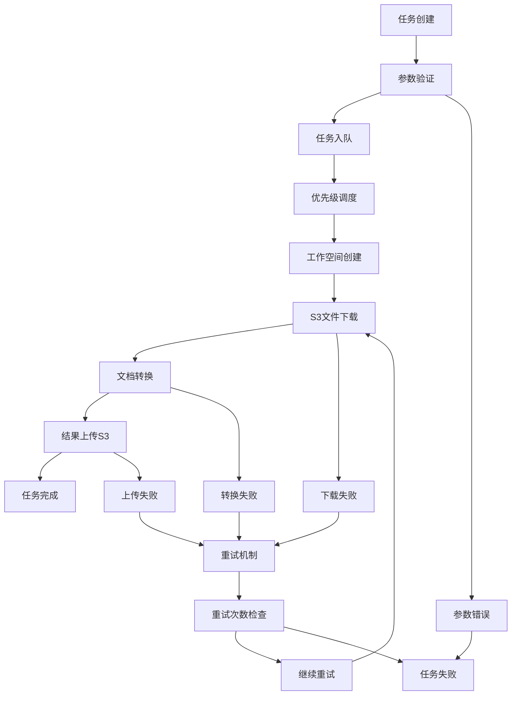
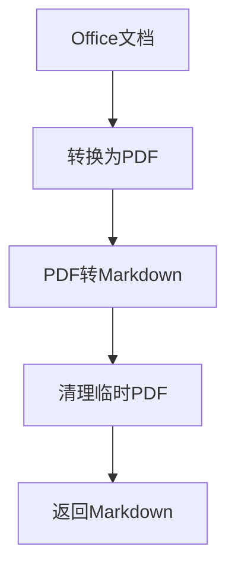
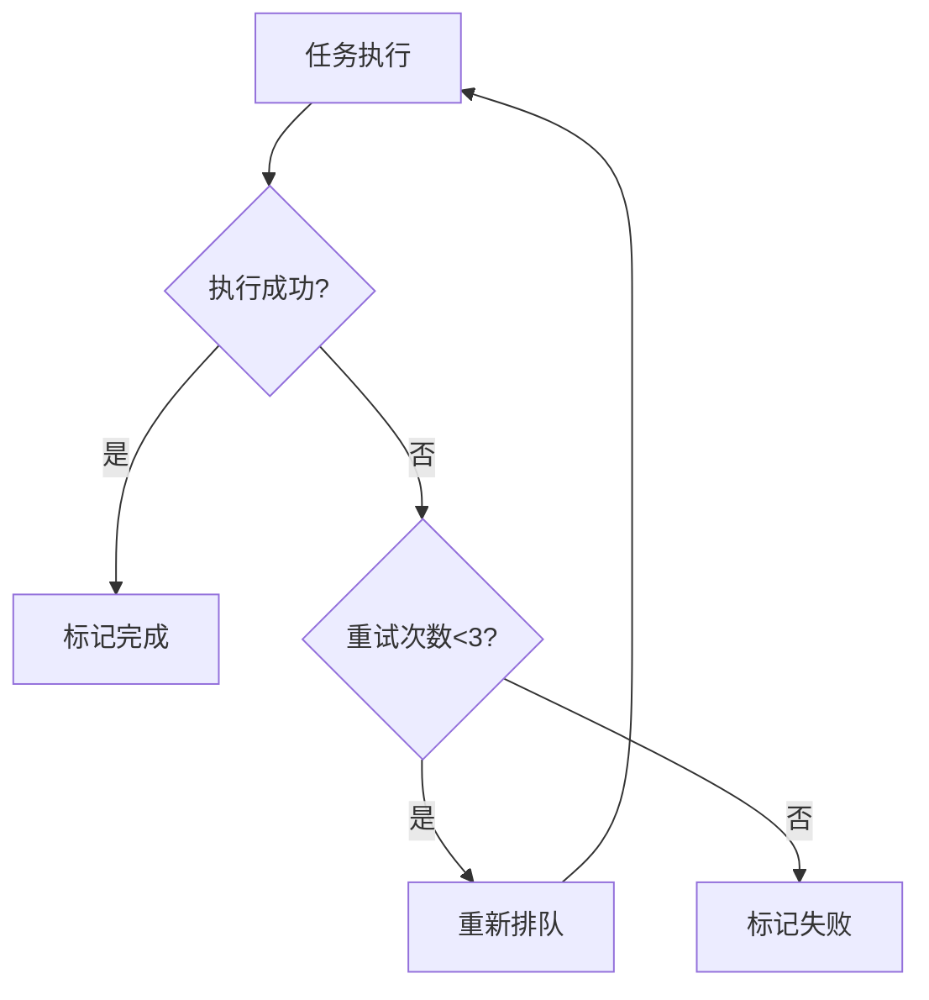

# 任务处理完整指南

本文档详细描述了文档转换服务的任务处理流程，包括系统架构、处理流程、API接口和技术实现细节。

## 🏗️ 系统架构概览

### 核心组件

1. **API服务器** (`api/unified_document_api.py`)
   - 基于FastAPI框架
   - 提供REST API接口
   - 支持文件上传和任务管理

2. **增强任务处理器** (`processors/enhanced_task_processor.py`)
   - 异步任务调度引擎
   - 多队列管理系统
   - 支持并发处理和错误重试

3. **文档转换服务** (`services/document_service.py`)
   - 集成LibreOffice和MinerU
   - 提供统一的文档转换接口
   - 支持批量处理

4. **存储服务** (`services/s3_*_service.py`)
   - S3下载服务：从云存储下载输入文件
   - S3上传服务：上传转换结果到云存储
   - 支持AWS S3、MinIO等兼容存储

### 队列系统架构

任务处理器采用多队列架构：

```
┌─────────────────┐    ┌─────────────────┐    ┌─────────────────┐
│   fetch_queue   │────│ priority_queues │────│ processing_queue│
│   (待获取任务)   │    │ (优先级调度)     │    │   (任务处理)     │
└─────────────────┘    └─────────────────┘    └─────────────────┘
         │                       │                       │
         │                       │                       │
┌─────────────────┐    ┌─────────────────┐    ┌─────────────────┐
│  update_queue   │    │  cleanup_queue  │    │ callback_queue  │
│  (状态更新)      │    │   (资源清理)     │    │   (回调通知)     │
└─────────────────┘    └─────────────────┘    └─────────────────┘
```

**队列详细说明**：
- **fetch_queue**: 待获取任务队列
- **high_priority_queue**: 高优先级任务队列（立即处理）
- **normal_priority_queue**: 普通优先级任务队列（正常处理）
- **low_priority_queue**: 低优先级任务队列（最后处理）
- **task_processing_queue**: 任务处理队列
- **update_queue**: 状态更新队列
- **cleanup_queue**: 清理队列
- **callback_queue**: 回调队列

## 🔄 任务生命周期详解

### 任务状态枚举
| 状态 | 描述 | 可转换状态 |
|------|------|------------|
| `pending` | 等待处理 | `processing`, `failed` |
| `processing` | 正在处理 | `completed`, `failed` |
| `completed` | 处理完成 | - |
| `failed` | 处理失败 | `pending` (重试) |

### 完整处理流程



## 📋 详细处理阶段

### 1. 任务创建阶段

#### 1.1 API请求接收
```http
POST /api/tasks/create
Content-Type: multipart/form-data

task_type=pdf_to_markdown
bucket_name=documents
file_path=reports/annual_report.pdf
platform=your-platform
priority=high
```

#### 1.2 参数验证
- **task_type**: 验证是否为支持的类型
- **bucket_name**: 验证S3存储桶名称格式
- **file_path**: 验证文件路径格式
- **priority**: 验证优先级值

#### 1.3 任务对象创建
```python
task = DocumentTask(
    task_type="pdf_to_markdown",
    bucket_name="documents",
    file_path="reports/annual_report.pdf",
    platform="your-platform",
    priority="high",
    status="pending",
    created_at=datetime.utcnow()
)
```

### 2. 任务调度阶段

#### 2.1 优先级队列调度
```python
# 智能调度算法
async def _priority_scheduler_worker(self):
    while self.is_running:
        # 优先处理高优先级任务
        if not self.high_priority_queue.empty():
            task = await self.high_priority_queue.get()
        elif not self.normal_priority_queue.empty():
            task = await self.normal_priority_queue.get()
        else:
            task = await self.low_priority_queue.get()
```

#### 2.2 工作线程分配
- 检查可用工作线程
- 按优先级从队列取任务
- 分配给空闲工作线程

### 3. 任务执行阶段

#### 3.1 工作空间创建
```bash
# 创建任务专用工作空间
/app/task_workspace/task_{task_id}/
├── input/          # 输入文件目录
├── output/         # 输出文件目录
└── temp/           # 临时文件目录
```

**日志示例**:
```
2025-08-09 19:38:35 - utils.workspace_manager - INFO - Created task workspace: /app/task_workspace/task_123
```

#### 3.2 S3文件下载
```python
# S3下载流程
s3_client = create_s3_client()
download_path = f"/app/task_workspace/task_{task_id}/input/{filename}"
s3_client.download_file(bucket_name, file_path, download_path)
```

**日志示例**:
```
2025-08-09 19:38:35 - services.s3_download_service - INFO - Starting download from s3://documents/reports/annual_report.pdf
2025-08-09 19:38:35 - services.s3_download_service - INFO - File info - Size: 1048576 bytes, Type: application/pdf
2025-08-09 19:38:35 - services.s3_download_service - INFO - Successfully downloaded 1048576 bytes in 0.50s
```

#### 3.3 文档转换处理

##### PDF转Markdown流程
```python
# 1. 加载PDF文件
pdf_document = load_pdf(input_path)

# 2. MinerU分析
analysis_result = mineru_pipeline.analyze(pdf_document)

# 3. 内容提取
markdown_content = extract_markdown(analysis_result)
json_structure = extract_structure(analysis_result)
images = extract_images(analysis_result)

# 4. 保存结果
save_markdown(output_path, markdown_content)
save_json(output_path, json_structure)
save_images(output_path, images)
```

**技术实现**:
- 使用MinerU 2.0 Python API
- 支持中文OCR识别
- GPU加速处理
- 自动内存管理

**日志示例**:
```
2025-08-09 19:38:36 - services.document_service - INFO - Converting PDF to Markdown: input.pdf -> output.md
2025-08-09 19:38:36 - services.document_service - INFO - Using MinerU 2.0 Python API to convert PDF
2025-08-09 19:40:26 - services.document_service - INFO - MinerU analysis completed, processing results...
2025-08-09 19:40:59 - services.document_service - INFO - MinerU conversion completed successfully
```

##### Office转PDF流程
```python
# LibreOffice转换
libreoffice_cmd = [
    "/usr/bin/libreoffice",
    "--headless",
    "--convert-to", "pdf",
    "--outdir", output_dir,
    input_path
]
subprocess.run(libreoffice_cmd, timeout=300)
```

**技术实现**:
- 使用LibreOffice headless模式
- 支持格式：.doc, .docx, .xls, .xlsx, .ppt, .pptx, .odt, .ods, .odp, .rtf
- 异步subprocess执行

**日志示例**:
```
2025-08-09 19:42:00 - services.document_service - INFO - Converting Office document to PDF: input.docx -> output.pdf
2025-08-09 19:42:07 - services.document_service - INFO - Office to PDF conversion completed successfully
```

##### Office直接转Markdown流程


#### 3.4 S3结果上传

##### 路径解析逻辑
```python
# S3存储桶文件示例
# 输入: s3://documents/reports/annual_report.pdf
# 解析结果:
original_bucket = "documents"
original_folder = "reports"
file_name = "annual_report"
conversion_type = "pdf_to_markdown"  # 根据任务类型确定

# 路径构建逻辑:
if original_bucket == "ai-file":
    # ai-file存储桶内文件，避免重复路径
    s3_key_prefix = f"{original_folder}/{file_name}/{conversion_type}/"
else:
    # 外部存储桶文件，统一存储到ai-file
    s3_key_prefix = f"{original_bucket}/{file_name}/{conversion_type}/"
```

**输出路径规则**:
- 单文件输出：`s3://ai-file/{bucket}/{filename_without_ext}/{conversion_type}/{output_filename}`
- 目录输出：`s3://ai-file/{bucket}/{filename_without_ext}/{conversion_type}/`

## 🔧 支持的任务类型

### 基础转换类型
- `office_to_pdf`: Office文档转PDF
- `pdf_to_markdown`: PDF转Markdown
- `office_to_markdown`: Office文档直接转Markdown（两步转换）

### 批量转换类型
- `batch_office_to_pdf`: 批量Office转PDF
- `batch_pdf_to_markdown`: 批量PDF转Markdown
- `batch_office_to_markdown`: 批量Office转Markdown

## ⚠️ 错误处理和重试机制

### 重试策略


### 常见错误类型
- GPU内存不足
- CUDA不可用
- 文件权限问题
- 模型加载错误
- 参数值错误
- S3连接超时
- 文件格式不支持

### 错误恢复机制
1. **自动重试**: 最多3次重试机会
2. **资源清理**: 失败任务自动清理工作空间
3. **状态回滚**: 失败后状态回滚到pending
4. **日志记录**: 详细的错误日志和堆栈跟踪

## 🔍 监控和统计

### 系统监控指标
- 任务总数统计
- 各状态任务数量
- 队列长度监控
- 处理器运行状态
- 工作空间使用情况

### 性能指标
- 任务处理时间
- 文件转换速度
- 系统资源使用率
- 错误率统计

---

本文档涵盖了文档转换服务的完整任务处理流程，为开发者和运维人员提供了详细的技术参考。