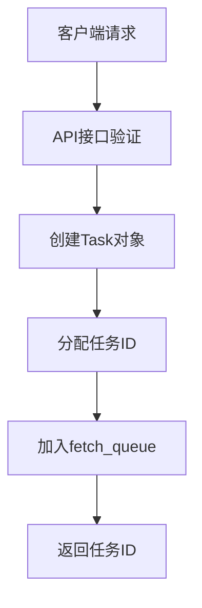
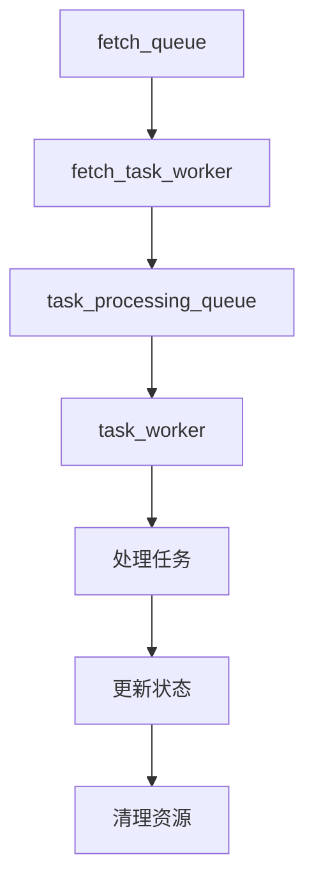
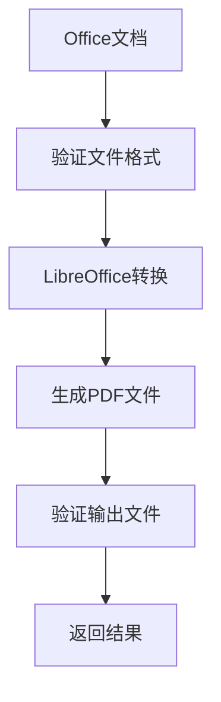
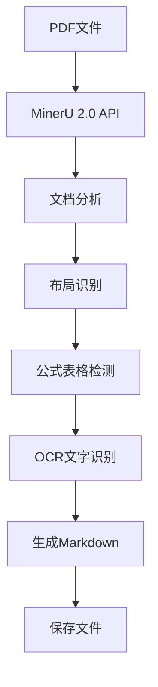
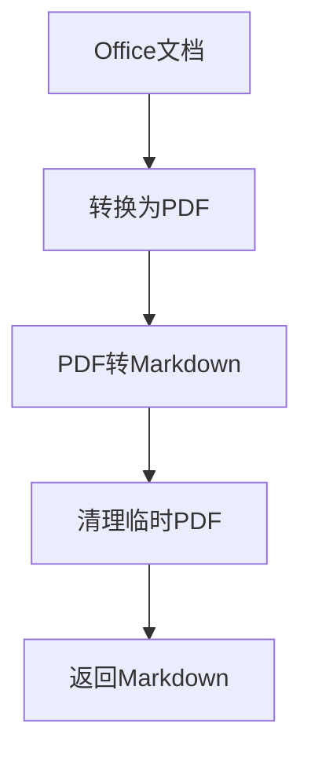
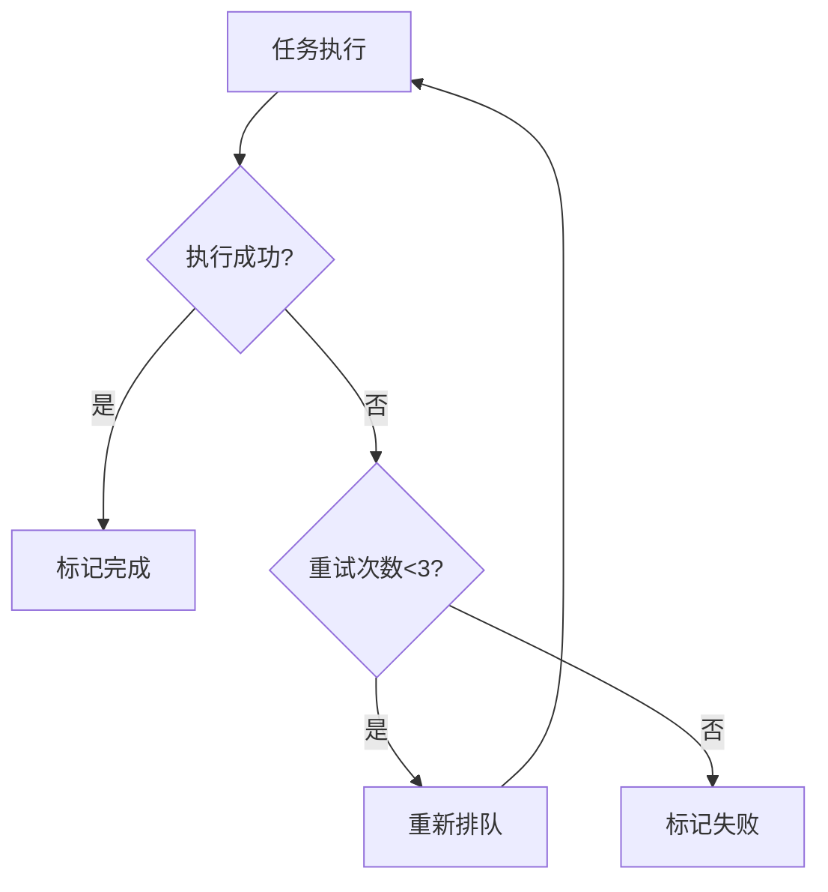

# 文档转换任务处理流程

## 系统概述

文档转换调度系统是一个基于FastAPI和异步任务处理的文档转换服务，支持Office文档转PDF、PDF转Markdown等多种转换类型。

## 系统架构

### 核心组件

1. **API服务器** (`api/main.py`)
   - 基于FastAPI框架
   - 提供REST API接口
   - 支持文件上传和任务管理

2. **任务处理器** (`processors/task_processor.py`)
   - 异步任务调度引擎
   - 多队列管理系统
   - 支持并发处理和错误重试

3. **文档服务** (`services/document_service.py`)
   - 集成LibreOffice和MinerU
   - 提供统一的文档转换接口
   - 支持批量处理

### 队列系统

任务处理器采用多队列架构：

- **fetch_queue**: 待获取任务队列
- **task_processing_queue**: 任务处理队列
- **update_queue**: 状态更新队列
- **cleanup_queue**: 清理队列
- **callback_queue**: 回调队列

## 任务处理流程

### 1. 任务创建



**支持的任务类型：**
- `office_to_pdf`: Office文档转PDF
- `pdf_to_markdown`: PDF转Markdown
- `office_to_markdown`: Office文档直接转Markdown
- `batch_office_to_pdf`: 批量Office转PDF
- `batch_pdf_to_markdown`: 批量PDF转Markdown
- `batch_office_to_markdown`: 批量Office转Markdown

### 2. 任务调度



**工作协程：**
- `_fetch_task_worker()`: 从fetch_queue获取任务
- `_task_worker()`: 并发处理任务（默认3个worker）
- `_update_task_worker()`: 更新任务状态
- `_cleanup_worker()`: 清理临时文件
- `_callback_worker()`: 处理回调通知

### 3. 任务执行

#### Office转PDF流程



**技术实现：**
- 使用LibreOffice headless模式
- 支持格式：.doc, .docx, .xls, .xlsx, .ppt, .pptx, .odt, .ods, .odp, .rtf
- 异步subprocess执行

#### PDF转Markdown流程



**技术实现：**
- 使用MinerU 2.0 Python API
- 支持中文OCR识别
- GPU加速处理
- 自动内存管理

#### Office直接转Markdown流程



### 4. 错误处理和重试



**错误分析：**
- GPU内存不足
- CUDA不可用
- 文件权限问题
- 模型加载错误
- 参数值错误

## API接口

### 核心接口

1. **创建任务**
   ```
   POST /api/tasks
   ```

2. **查询任务状态**
   ```
   GET /api/tasks/{task_id}
   ```

3. **获取队列统计**
   ```
   GET /api/stats
   ```

### 快捷接口

1. **Office转PDF**
   ```
   GET /api/shortcuts/office-to-pdf?input_path=...&output_path=...
   ```

2. **PDF转Markdown**
   ```
   GET /api/shortcuts/pdf-to-markdown?input_path=...&output_path=...
   ```

3. **Office转Markdown**
   ```
   GET /api/shortcuts/office-to-markdown?input_path=...&output_path=...
   ```

### 文件上传接口

1. **上传并转换**
   ```
   POST /api/upload-and-convert
   ```

2. **下载转换结果**
   ```
   GET /api/download/{task_id}
   ```

## 任务状态

- **pending**: 等待处理
- **processing**: 正在处理
- **completed**: 处理完成
- **failed**: 处理失败

## 工作空间管理

### 目录结构

```
/workspace/
├── test/                    # 测试文件目录
├── output/                  # 输出文件目录
├── task_workspace/          # 任务工作空间
│   └── output/
│       └── task_*/          # 单个任务目录
│           ├── input/       # 输入文件
│           └── output/      # 输出文件
└── temp/                    # 临时文件目录
```

### 文件管理

- 每个任务创建独立工作目录
- 自动清理临时文件
- 支持文件下载和访问

## 监控和日志

### 日志级别

- **INFO**: 正常操作日志
- **WARNING**: 警告信息
- **ERROR**: 错误信息
- **DEBUG**: 调试信息

### 监控指标

- 队列长度统计
- 任务执行状态
- 成功/失败率
- 处理时间统计

## 性能优化

### 并发处理

- 默认3个并发worker
- 可配置最大并发数
- 异步I/O操作

### 内存管理

- GPU内存自动清理
- 临时文件及时删除
- 垃圾回收机制

### 错误恢复

- 智能重试机制
- 错误分类处理
- 详细错误报告

## 部署和配置

### 环境要求

- Python 3.11+
- LibreOffice
- MinerU 2.0
- CUDA支持（可选）

### 启动方式

1. **API服务器模式**
   ```bash
   python start.py
   ```

2. **演示任务模式**
   ```bash
   python start.py demo
   ```

### 配置参数

- `max_concurrent_tasks`: 最大并发任务数（默认3）
- `task_check_interval`: 任务检查间隔（默认5秒）
- `workspace_dir`: 工作空间目录

## 测试和验证

### 批量测试

使用 `test_batch_conversion.py` 脚本进行批量测试：

```bash
python test_batch_conversion.py
```

### 测试覆盖

- Office文档转换测试
- PDF转换测试
- 批量处理测试
- 错误处理测试
- 性能压力测试

## 故障排除

### 常见问题

1. **LibreOffice转换失败**
   - 检查LibreOffice安装
   - 验证文件格式支持
   - 检查文件权限

2. **MinerU转换失败**
   - 检查GPU内存
   - 验证CUDA环境
   - 检查模型文件

3. **任务队列阻塞**
   - 检查worker状态
   - 重启任务处理器
   - 清理异常任务

### 调试方法

1. 查看API服务器日志
2. 检查任务状态详情
3. 验证输入输出文件
4. 分析错误堆栈信息
