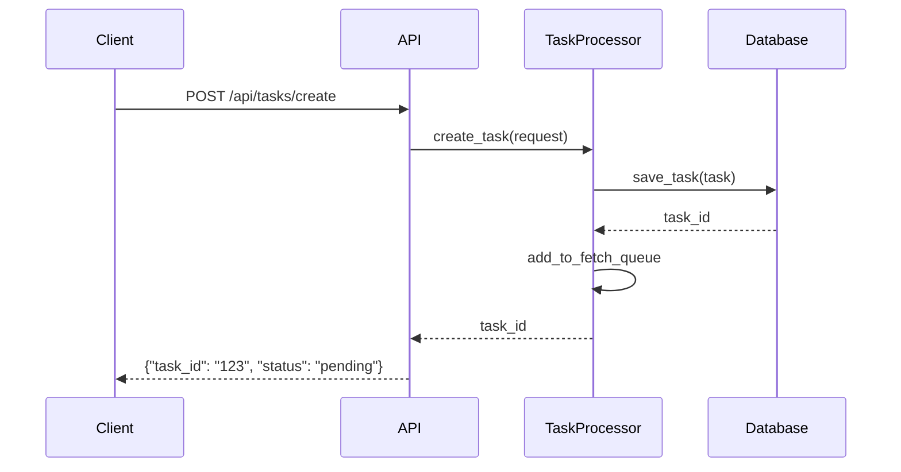
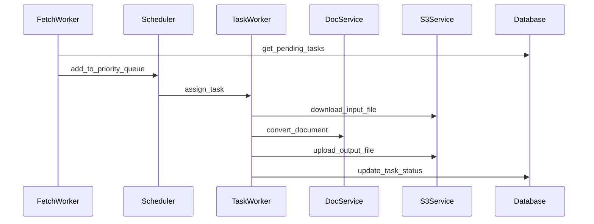

# 文档转换服务 - 技术架构文档

## 项目概述

本项目是一个企业级文档转换服务，基于FastAPI框架构建，复刻了MediaConvert的架构设计理念。系统支持多种文档格式转换，包括Office文档转PDF、PDF转Markdown等，并提供完整的任务管理、云存储集成和监控功能。

### 核心特性
- 🚀 **高性能异步处理**: 基于FastAPI和asyncio的异步架构
- 📊 **企业级任务管理**: 支持任务队列、优先级调度和状态跟踪
- ☁️ **云存储集成**: 完整的S3/MinIO存储支持
- 🔄 **多格式转换**: Office转PDF、PDF转Markdown、图片转Markdown
- 📈 **实时监控**: 完整的日志记录和任务统计
- 🛡️ **容错机制**: 自动重试、错误恢复和资源清理

## 系统架构设计

### 整体架构图
```
┌─────────────────┐    ┌─────────────────┐    ┌─────────────────┐
│   API Gateway   │────│  Task Processor │────│  Document Service│
│   (FastAPI)     │    │  (Enhanced)     │    │  (LibreOffice)  │
└─────────────────┘    └─────────────────┘    └─────────────────┘
         │                       │                       │
         │                       │                       │
┌─────────────────┐    ┌─────────────────┐    ┌─────────────────┐
│  Database Mgr   │    │ Workspace Mgr   │    │   S3 Services   │
│ (SQLite/MySQL)  │    │ (File System)   │    │ (Upload/Download)│
└─────────────────┘    └─────────────────┘    └─────────────────┘
```

### 核心组件

#### 1. API网关层 (`main.py`, `api/unified_document_api.py`)
- **职责**: 统一API入口，请求路由和参数验证
- **主要接口**:
  - `POST /api/tasks/create` - 创建转换任务
  - `GET /api/tasks/{task_id}` - 查询任务状态
  - `GET /health` - 健康检查
  - `GET /api/tasks` - 任务列表查询

#### 2. 增强任务处理器 (`processors/enhanced_task_processor.py`)
- **职责**: 核心任务调度和处理引擎
- **设计特点**:
  - 多队列架构：获取队列、处理队列、更新队列、清理队列
  - 优先级调度：高优先级、普通优先级、低优先级队列
  - 并发控制：可配置的最大并发任务数
  - 生命周期管理：任务创建、执行、完成、清理

#### 3. 数据库管理器 (`database/database_manager.py`)
- **职责**: 数据持久化和任务状态管理
- **支持数据库**: SQLite（开发）、MySQL（生产）
- **核心功能**:
  - 任务CRUD操作
  - 连接池管理
  - 自动重连机制
  - 事务管理

#### 4. 文档转换服务 (`services/document_service.py`)
- **职责**: 具体的文档转换实现
- **支持转换类型**:
  - Office转PDF（LibreOffice）
  - PDF转Markdown（MinerU）
  - 图片转Markdown
  - 批量转换

#### 5. 存储服务 (`services/s3_*_service.py`)
- **S3下载服务**: 从云存储下载输入文件
- **S3上传服务**: 上传转换结果到云存储
- **特性**: 支持AWS S3、MinIO等兼容存储

#### 6. 工作空间管理器 (`utils/workspace_manager.py`)
- **职责**: 任务工作目录管理和文件组织
- **目录结构**:
  ```
  /app/task_workspace/
  ├── task_{id}/
  │   ├── input/     # 输入文件
  │   ├── output/    # 输出文件
  │   └── temp/      # 临时文件
  ```

## 工作流程详解

### 1. 任务创建流程


### 2. 任务处理流程


### 3. 数据流转过程

#### 输入数据流
1. **API接收**: 客户端提交转换请求
2. **参数验证**: 验证任务类型、文件路径等参数
3. **任务入库**: 创建数据库记录，分配唯一ID
4. **队列调度**: 任务进入获取队列等待处理

#### 处理数据流
1. **文件获取**: 从S3下载或复制本地文件到工作空间
2. **格式转换**: 调用相应转换工具处理文件
3. **结果存储**: 将转换结果保存到输出目录
4. **云端上传**: 上传结果文件到S3存储
5. **状态更新**: 更新数据库中的任务状态和结果信息

#### 输出数据流
1. **结果查询**: 客户端查询任务状态和结果
2. **文件下载**: 提供转换后文件的下载链接
3. **清理机制**: 定期清理临时文件和过期任务

## 关键技术实现

### 1. 异步任务处理
```python
# 多工作协程并发处理
self.workers = [
    asyncio.create_task(self._fetch_task_worker()),
    asyncio.create_task(self._priority_scheduler_worker()),
    asyncio.create_task(self._update_task_worker()),
    asyncio.create_task(self._cleanup_worker()),
    asyncio.create_task(self._callback_worker()),
]

# 任务处理工作协程
for i in range(self.max_concurrent_tasks):
    worker = asyncio.create_task(self._task_worker(i))
    self.workers.append(worker)
```

### 2. 优先级队列调度
```python
# 多优先级队列设计
self.high_priority_queue = asyncio.Queue()   # 高优先级
self.normal_priority_queue = asyncio.Queue() # 普通优先级
self.low_priority_queue = asyncio.Queue()    # 低优先级

# 智能调度算法
async def _priority_scheduler_worker(self):
    while self.is_running:
        # 优先处理高优先级任务
        if not self.high_priority_queue.empty():
            task = await self.high_priority_queue.get()
        elif not self.normal_priority_queue.empty():
            task = await self.normal_priority_queue.get()
        else:
            task = await self.low_priority_queue.get()
```

### 3. 数据库连接管理
```python
@asynccontextmanager
async def get_session(self):
    """获取数据库会话的上下文管理器"""
    if not self._is_connected or not self._session_factory:
        await self._connect()
    
    async with self._session_factory() as session:
        try:
            yield session
        except Exception as e:
            await session.rollback()
            raise
        finally:
            await session.close()
```

### 4. 文档转换集成
```python
# LibreOffice转换
cmd = [
    self.libreoffice_path,
    '--headless',
    '--convert-to', 'pdf',
    '--outdir', str(output_file.parent),
    str(input_file)
]

# MinerU PDF转Markdown
from mineru.cli.common import read_fn
from mineru.backend.pipeline.pipeline_analyze import doc_analyze
```

### 5. 错误处理和重试机制
```python
# 任务重试逻辑
max_retries = 3
for attempt in range(max_retries):
    try:
        result = await self._process_task(task)
        break
    except Exception as e:
        if attempt < max_retries - 1:
            await asyncio.sleep(2 ** attempt)  # 指数退避
            continue
        else:
            await self._mark_task_failed(task_id, str(e))
```

## 系统特性和优势

### 1. 高可用性
- **自动重连**: 数据库连接断开自动重连
- **任务恢复**: 服务重启后自动恢复未完成任务
- **错误隔离**: 单个任务失败不影响其他任务

### 2. 可扩展性
- **水平扩展**: 支持多实例部署
- **插件化设计**: 易于添加新的转换类型
- **配置驱动**: 通过环境变量灵活配置

### 3. 监控和运维
- **结构化日志**: 详细的任务执行日志
- **性能指标**: 任务统计和处理时间监控
- **健康检查**: 完整的系统健康状态检查

### 4. 安全性
- **文件隔离**: 每个任务独立的工作空间
- **权限控制**: S3访问权限管理
- **数据清理**: 自动清理临时文件和敏感数据

## 部署和配置

### 环境变量配置
```bash
# 数据库配置
DATABASE_TYPE=sqlite
DATABASE_URL=sqlite:///./document_tasks.db

# S3存储配置
S3_ACCESS_KEY_ID=your_access_key
S3_SECRET_ACCESS_KEY=your_secret_key
S3_ENDPOINT_URL=http://localhost:9000
S3_BUCKET=ai-file

# 服务配置
HOST=0.0.0.0
PORT=8000
WORKERS=1
MAX_CONCURRENT_TASKS=3
```

### Docker部署
```dockerfile
FROM python:3.11-slim

# 安装LibreOffice
RUN apt-get update && apt-get install -y libreoffice

# 安装Python依赖
COPY requirements.txt .
RUN pip install -r requirements.txt

# 复制应用代码
COPY . /app
WORKDIR /app

# 启动服务
CMD ["python", "main.py"]
```

## 性能优化建议

### 1. 数据库优化
- 使用MySQL替代SQLite提升并发性能
- 添加适当的数据库索引
- 配置连接池参数

### 2. 存储优化
- 使用CDN加速文件下载
- 实现文件缓存机制
- 优化大文件传输

### 3. 处理优化
- 根据服务器资源调整并发任务数
- 实现任务优先级动态调整
- 添加任务预处理和后处理钩子

## 总结

本文档转换服务采用现代化的微服务架构设计，具备高性能、高可用、易扩展的特点。通过合理的组件划分、异步处理机制和完善的错误处理，能够满足企业级文档转换的需求。系统设计充分考虑了可维护性和可扩展性，为后续功能扩展和性能优化提供了良好的基础。