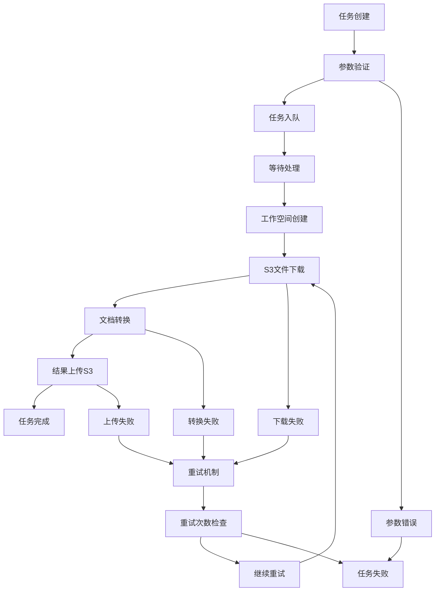

# 任务处理详细流程

本文档详细描述了文档转换服务的任务处理流程，包括每个阶段的具体操作、状态变化和错误处理机制。

## 🔄 任务生命周期概览



## 📋 任务状态详解

### 状态枚举
| 状态 | 描述 | 可转换状态 |
|------|------|------------|
| `pending` | 等待处理 | `processing`, `failed` |
| `processing` | 正在处理 | `completed`, `failed` |
| `completed` | 处理完成 | - |
| `failed` | 处理失败 | `pending` (重试) |

### 状态转换时机
1. **pending → processing**: 工作线程开始处理任务
2. **processing → completed**: 所有步骤成功完成
3. **processing → failed**: 任何步骤发生不可恢复错误
4. **failed → pending**: 手动重试或自动重试

## 🚀 详细处理流程

### 1. 任务创建阶段

#### 1.1 API请求接收
```http
POST /api/tasks/create
Content-Type: multipart/form-data

task_type=pdf_to_markdown
bucket_name=documents
file_path=reports/annual_report.pdf
platform=your-platform
priority=high
```

#### 1.2 参数验证
- **task_type**: 验证是否为支持的类型
- **bucket_name**: 验证S3存储桶名称格式
- **file_path**: 验证文件路径格式
- **priority**: 验证优先级值

#### 1.3 任务对象创建
```python
task = DocumentTask(
    task_type="pdf_to_markdown",
    bucket_name="documents",
    file_path="reports/annual_report.pdf",
    platform="your-platform",
    priority="high",
    status="pending",
    created_at=datetime.utcnow()
)
```

#### 1.4 数据库存储
- 生成唯一任务ID
- 存储到SQLite/PostgreSQL数据库
- 返回任务创建响应

### 2. 任务调度阶段

#### 2.1 优先级队列
```python
# 队列优先级顺序
high_priority_queue    # 立即处理
normal_priority_queue  # 正常处理
low_priority_queue     # 最后处理
```

#### 2.2 工作线程分配
- 检查可用工作线程
- 按优先级从队列取任务
- 分配给空闲工作线程

### 3. 任务执行阶段

#### 3.1 工作空间创建
```bash
# 创建任务专用工作空间
/app/task_workspace/task_{task_id}/
├── input/          # 输入文件目录
├── output/         # 输出文件目录
└── temp/           # 临时文件目录
```

**日志示例**:
```
2025-08-09 19:38:35 - utils.workspace_manager - INFO - Created task workspace: /app/task_workspace/task_123
```

#### 3.2 S3文件下载
```python
# S3下载流程
s3_client = create_s3_client()
download_path = f"/app/task_workspace/task_{task_id}/input/{filename}"
s3_client.download_file(bucket_name, file_path, download_path)
```

**日志示例**:
```
2025-08-09 19:38:35 - services.s3_download_service - INFO - Starting download from s3://documents/reports/annual_report.pdf
2025-08-09 19:38:35 - services.s3_download_service - INFO - File info - Size: 1048576 bytes, Type: application/pdf
2025-08-09 19:38:35 - services.s3_download_service - INFO - Successfully downloaded 1048576 bytes in 0.50s
```

#### 3.3 文档转换处理

##### PDF转Markdown流程
```python
# 1. 加载PDF文件
pdf_document = load_pdf(input_path)

# 2. MinerU分析
analysis_result = mineru_pipeline.analyze(pdf_document)

# 3. 内容提取
markdown_content = extract_markdown(analysis_result)
json_structure = extract_structure(analysis_result)
images = extract_images(analysis_result)

# 4. 保存结果
save_markdown(output_path, markdown_content)
save_json(output_path, json_structure)
save_images(output_path, images)
```

**日志示例**:
```
2025-08-09 19:38:36 - services.document_service - INFO - Converting PDF to Markdown: input.pdf -> output.md
2025-08-09 19:38:36 - services.document_service - INFO - Using MinerU 2.0 Python API to convert PDF
2025-08-09 19:38:36 - services.document_service - INFO - PDF file loaded: annual_report, size: 1048576 bytes
2025-08-09 19:38:36 - services.document_service - INFO - Starting MinerU pipeline analysis...
2025-08-09 19:40:26 - services.document_service - INFO - MinerU analysis completed, processing results...
2025-08-09 19:40:59 - services.document_service - INFO - MinerU conversion completed successfully
```

##### Office转PDF流程
```python
# 1. LibreOffice转换
libreoffice_cmd = [
    "/usr/bin/libreoffice",
    "--headless",
    "--convert-to", "pdf",
    "--outdir", output_dir,
    input_path
]
subprocess.run(libreoffice_cmd, timeout=300)
```

**日志示例**:
```
2025-08-09 19:42:00 - services.document_service - INFO - Converting Office document to PDF: input.docx -> output.pdf
2025-08-09 19:42:07 - services.document_service - INFO - Office to PDF conversion completed successfully
```

#### 3.4 S3结果上传

##### 路径解析逻辑
```python
# 输入: s3://documents/reports/annual_report.pdf
# 解析结果:
original_bucket = "documents"
file_name = "annual_report"
conversion_type = "markdown"  # 根据任务类型确定

# 输出路径: s3://ai-file/documents/annual_report/markdown/
output_prefix = f"ai-file/{original_bucket}/{file_name}/{conversion_type}/"
```

##### 文件上传流程
```python
# 上传所有输出文件
for file in output_files:
    s3_key = f"{output_prefix}{file.name}"
    s3_client.upload_file(file.path, "ai-file", s3_key)
    s3_urls.append(f"s3://ai-file/{s3_key}")
```

**日志示例**:
```
2025-08-09 19:41:00 - services.s3_upload_service - INFO - Starting upload to s3://ai-file/documents/annual_report/markdown/annual_report.md
2025-08-09 19:41:00 - services.s3_upload_service - INFO - Successfully uploaded 19988 bytes in 0.25s
2025-08-09 19:41:02 - services.s3_upload_service - INFO - Complete conversion result uploaded: 6 files, 916094 bytes
```

### 4. 任务完成阶段

#### 4.1 状态更新
```python
task.status = "completed"
task.completed_at = datetime.utcnow()
task.task_processing_time = (completed_at - started_at).total_seconds()
task.output_url = main_output_s3_url
task.s3_urls = all_s3_urls
```

#### 4.2 工作空间清理
```python
# 可选：清理临时文件
if cleanup_enabled:
    shutil.rmtree(task_workspace_path)
```

## ⚠️ 错误处理机制

### 错误类型分类

#### 1. 可重试错误
- **网络错误**: S3连接超时、网络中断
- **临时资源不足**: GPU内存不足、磁盘空间不足
- **服务暂时不可用**: S3服务临时故障

#### 2. 不可重试错误
- **文件不存在**: S3中找不到指定文件
- **格式不支持**: 文件格式不被支持
- **权限错误**: S3访问权限不足
- **参数错误**: 任务参数格式错误

### 重试策略

#### 自动重试
```python
max_retry_count = 3
retry_delay = [30, 60, 120]  # 秒

for attempt in range(max_retry_count):
    try:
        process_task()
        break
    except RetryableError as e:
        if attempt < max_retry_count - 1:
            time.sleep(retry_delay[attempt])
            continue
        else:
            mark_task_failed()
```

#### 手动重试
```bash
# 重试单个任务
curl -X POST "http://localhost:8000/api/tasks/123/retry"

# 批量重试失败任务
curl -X POST "http://localhost:8000/api/tasks/retry-failed"
```

## 📊 性能监控

### 关键指标
- **任务处理时间**: 从开始到完成的总时间
- **队列等待时间**: 任务在队列中的等待时间
- **转换速度**: 文件大小/处理时间
- **成功率**: 成功任务数/总任务数
- **重试率**: 重试任务数/总任务数

### 日志级别
- **INFO**: 正常流程日志
- **WARNING**: 可恢复的异常情况
- **ERROR**: 错误和异常
- **DEBUG**: 详细的调试信息

## 🔧 配置参数

### 任务处理配置
```python
MAX_CONCURRENT_TASKS = 3        # 最大并发任务数
TASK_TIMEOUT = 3600             # 任务超时时间(秒)
MAX_RETRY_COUNT = 3             # 最大重试次数
CLEANUP_COMPLETED_TASKS = True  # 是否清理完成任务的工作空间
WORKSPACE_RETENTION_DAYS = 7    # 工作空间保留天数
```

### GPU内存管理
```python
# 任务完成后自动清理GPU内存
torch.cuda.empty_cache()
gc.collect()
```

## 📝 故障排除指南

### 常见问题诊断

#### 1. 任务长时间处于pending状态
- 检查工作线程是否正常运行
- 检查队列是否有积压
- 检查系统资源使用情况

#### 2. S3下载失败
- 验证S3连接配置
- 检查文件路径是否正确
- 确认访问权限

#### 3. 转换失败
- 检查文件格式是否支持
- 查看详细错误日志
- 检查GPU内存使用情况

#### 4. 上传失败
- 检查网络连接
- 验证S3写入权限
- 检查磁盘空间

### 日志查看命令
```bash
# 查看特定任务日志
docker exec document-converter cat /app/log_files/task_123.log

# 查看应用日志
docker logs document-converter

# 实时监控日志
docker logs -f document-converter
```
