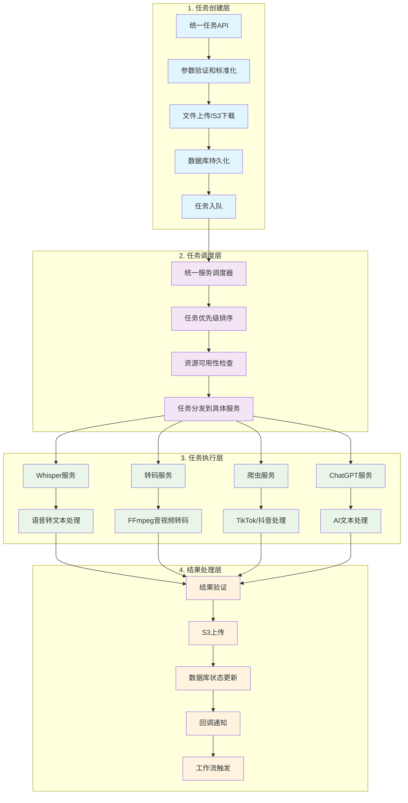
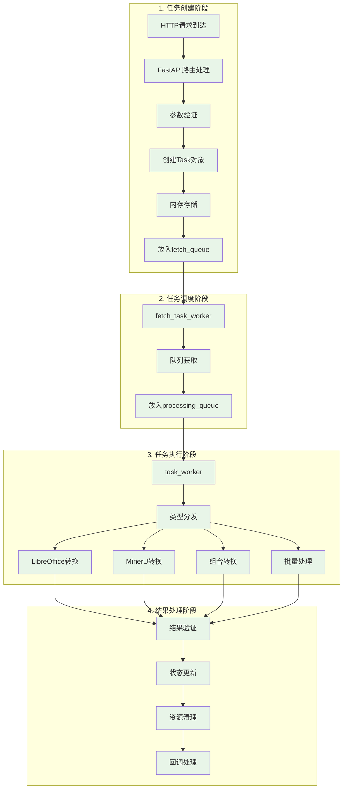

# MediaConvert vs MinerU文档转换系统 - 任务处理流程对比分析

## 📋 概述

本文档详细对比分析了MediaConvert项目和我们的MinerU文档转换调度系统在任务处理流程方面的差异，并总结了MediaConvert项目中值得借鉴的高级功能。

## 🏗️ 项目基本信息对比

| 项目 | MediaConvert | MinerU文档转换系统 |
|------|--------------|-------------------|
| **主要功能** | Whisper语音转文本 + 多媒体转码 | Office/PDF文档转换 |
| **核心技术** | Whisper AI + FFmpeg | LibreOffice + MinerU 2.0 |
| **数据存储** | MySQL/SQLite + S3 | 内存字典 + 本地文件 |
| **架构模式** | 微服务 + 数据库持久化 | 单体应用 + 内存队列 |
| **部署方式** | Docker + 数据库 | Docker单容器 |

## 🔄 任务处理流程对比

### MediaConvert任务处理流程



### MinerU文档转换系统流程



## 🔍 详细功能对比分析

### 1. 数据持久化和状态管理

#### MediaConvert的优势
```python
# 完整的数据库模型
class Task(TaskBase):
    id = Column(String(100), primary_key=True, index=True)
    callback_url = Column(String(255), nullable=True)
    callback_status_code = Column(Integer, nullable=True)
    callback_message = Column(String(512), nullable=True)
    callback_time = Column(DateTime, nullable=True)
    priority = Column(Enum(TaskPriority), default=TaskPriority.normal)
    status = Column(Enum(TaskStatus), default=TaskStatus.queued)
    language = Column(String(10), nullable=True)
    platform = Column(String(50), nullable=True)
    engine_name = Column(String(50), nullable=True)
    created_at = Column(DateTime, default=dt.datetime.now())
    updated_at = Column(DateTime, onupdate=dt.datetime.now())
    task_processing_time = Column(Float, nullable=True)
    file_path = Column(Text, nullable=True)
    file_name = Column(Text, nullable=True)
    file_url = Column(Text, nullable=True)
    file_size_bytes = Column(Integer, nullable=True)
    file_duration = Column(Float, nullable=True)
    decode_options = Column(JSON)
    result = Column(JSON, nullable=True)
    error_message = Column(Text, nullable=True)
    output_url = Column(String(255), nullable=True)
    s3_urls = Column(JSON, nullable=True)
    retry_count = Column(Integer, default=0, nullable=False)
    max_retry_count = Column(Integer, default=3, nullable=False)
    last_retry_at = Column(DateTime, nullable=True)
```

**优势特点**:
- ✅ **数据持久化**: 任务状态永久保存，服务重启不丢失
- ✅ **丰富的元数据**: 文件信息、处理时间、回调状态等详细记录
- ✅ **多平台支持**: platform字段支持不同来源的任务分类
- ✅ **灵活的重试策略**: 可配置的重试次数和时间记录

#### MinerU系统的局限
```python
@dataclass
class Task:
    task_id: int
    task_type: str
    status: str
    input_path: str
    output_path: str
    params: Dict[str, Any]
    priority: str = 'normal'
    created_at: Optional[datetime] = None
    started_at: Optional[datetime] = None
    completed_at: Optional[datetime] = None
    error_message: Optional[str] = None
    retry_count: int = 0
    max_retries: int = 3
```

**局限性**:
- ❌ **内存存储**: 服务重启后任务状态丢失
- ❌ **元数据不足**: 缺少文件大小、处理时间等重要信息
- ❌ **无回调状态**: 无法跟踪回调执行结果
- ❌ **简单的重试**: 缺少重试时间记录和策略配置

### 2. 文件处理和存储

#### MediaConvert的S3集成
```python
class S3UploadService:
    def upload_file(self, 
                   local_file_path: str,
                   s3_key: str,
                   bucket_name: str,
                   s3_config: Optional[Dict[str, Any]] = None,
                   metadata: Optional[Dict[str, str]] = None) -> Dict[str, Any]:
        """
        上传文件到S3，支持：
        - 多S3服务商支持
        - 自定义元数据
        - 上传进度跟踪
        - 错误重试机制
        """
```

**优势特点**:
- ✅ **云存储集成**: 支持AWS S3、阿里云OSS等多种云存储
- ✅ **分离式存储**: 下载和上传可使用不同的S3服务
- ✅ **元数据支持**: 文件上传时可附加自定义元数据
- ✅ **URL管理**: 自动生成和管理访问URL

#### MinerU系统的文件处理
```python
# 简单的本地文件处理
input_path = Path(task.input_path)
output_path = Path(task.output_path)
# 直接在本地文件系统操作
```

**局限性**:
- ❌ **本地存储限制**: 仅支持本地文件系统
- ❌ **无云存储**: 缺少云存储集成能力
- ❌ **文件管理简单**: 无文件版本管理和访问控制

### 3. 任务调度和优先级管理

#### MediaConvert的统一调度器
```python
class UnifiedServiceScheduler:
    async def schedule_task(self, task: Task) -> bool:
        """
        统一任务调度器，支持：
        - 任务优先级排序
        - 资源可用性检查
        - 负载均衡
        - 服务健康检查
        """
        # 检查服务可用性
        available_services = await self._check_service_availability()
        
        # 根据优先级和资源情况调度
        if task.priority == TaskPriority.high:
            return await self._schedule_high_priority_task(task)
        else:
            return await self._schedule_normal_task(task)
```

**优势特点**:
- ✅ **智能调度**: 基于优先级和资源可用性的智能调度
- ✅ **服务发现**: 自动检测和管理多个服务实例
- ✅ **负载均衡**: 任务在多个服务实例间均衡分配
- ✅ **健康检查**: 实时监控服务健康状态

#### MinerU系统的简单队列
```python
# 简单的FIFO队列处理
await self.fetch_queue.put(task_id)
task_id = await self.task_processing_queue.get()
```

**局限性**:
- ❌ **简单FIFO**: 缺少优先级调度机制
- ❌ **单实例**: 无多实例负载均衡
- ❌ **无服务发现**: 无法动态管理服务实例

### 4. 回调和通知系统

#### MediaConvert的回调服务
```python
class CallbackService:
    @retry(stop=stop_after_attempt(3), wait=wait_fixed(3))
    async def task_callback_notification(self,
                                         task: Task,
                                         db_manager: DatabaseManager,
                                         proxy_settings: Optional[Dict[str, str]] = None,
                                         method: str = "POST",
                                         headers: Optional[dict] = None,
                                         request_timeout: int = 10) -> None:
        """
        发送任务处理结果的回调通知，支持：
        - 自动重试机制
        - 代理设置
        - 自定义请求头
        - 回调状态跟踪
        """
        # 发送回调并记录结果
        response = await client.fetch_data(
            url=callback_url,
            method=method,
            headers=headers,
            json=task_data.to_dict()
        )

        # 更新回调状态
        await db_manager.update_task_callback_status(
            task_id=task.id,
            callback_status_code=response.status_code,
            callback_message=response.text
        )
```

**优势特点**:
- ✅ **可靠回调**: 自动重试机制确保回调成功
- ✅ **状态跟踪**: 记录回调执行状态和响应
- ✅ **灵活配置**: 支持自定义请求方法、头部、代理
- ✅ **错误处理**: 详细的错误信息记录

#### MinerU系统的简单回调
```python
async def _execute_task_callback(self, task: Task):
    """简单的回调处理"""
    try:
        if task.status == 'completed':
            self.logger.info(f"Task {task.task_id} completed successfully")
        elif task.status == 'failed':
            self.logger.error(f"Task {task.task_id} failed: {task.error_message}")
    except Exception as e:
        self.logger.error(f"Error executing callback for task {task.task_id}: {e}")
```

**局限性**:
- ❌ **无HTTP回调**: 仅支持日志记录，无外部通知
- ❌ **无重试机制**: 回调失败无法重试
- ❌ **无状态跟踪**: 无法知道回调是否成功执行

### 5. 工作流和任务编排

#### MediaConvert的工作流系统
```python
# 工作流模型
class Workflow(WorkFlowBase):
    __tablename__ = "workflow_workflows"

    id = Column(Integer, primary_key=True, index=True)
    name = Column(String(255), nullable=False)
    description = Column(Text, nullable=True)
    trigger_type = Column(Enum("MANUAL", "SCHEDULED", "EVENT", name="workflow_trigger_types"))
    callback_url = Column(Text, nullable=True)

    # 关联的任务
    tasks = relationship("WorkflowTask", back_populates="workflow")
    notifications = relationship("WorkflowNotification", back_populates="workflow")

class WorkflowTask(WorkFlowBase):
    __tablename__ = "workflow_tasks"

    task_id = Column(String(100), unique=True, nullable=False)
    workflow_id = Column(Integer, ForeignKey("workflow_workflows.id"))
    component = Column(String(255), nullable=False)
    parameters = Column(JSON, nullable=True)
    retry_policy = Column(JSON, nullable=True)
    timeout = Column(Integer, nullable=True)
    delay = Column(Integer, nullable=True)
    condition = Column(JSON, nullable=True)  # 条件执行
    on_failure = Column(Text, nullable=True)  # 失败处理
```

**优势特点**:
- ✅ **复杂工作流**: 支持多步骤任务编排
- ✅ **条件执行**: 基于条件的任务流控制
- ✅ **触发机制**: 手动、定时、事件触发
- ✅ **失败处理**: 自定义失败处理策略
- ✅ **通知系统**: 工作流级别的通知管理

#### MinerU系统的单任务处理
```python
# 仅支持单个任务的线性处理
async def _process_task(self, task: Task, workspace: Path) -> Dict[str, Any]:
    # 简单的任务类型分发
    if task.task_type == 'office_to_pdf':
        return await self._process_office_to_pdf(task, workspace)
    elif task.task_type == 'pdf_to_markdown':
        return await self._process_pdf_to_markdown(task, workspace)
    # ...
```

**局限性**:
- ❌ **无工作流**: 不支持多步骤任务编排
- ❌ **无条件执行**: 无法基于条件控制任务流
- ❌ **无依赖管理**: 任务间无依赖关系管理

### 6. 监控和管理功能

#### MediaConvert的管理接口
```python
# 管理员监控接口
@router.get("/admin/monitor/system", summary="系统监控")
async def get_system_monitor():
    """
    获取系统监控信息，包括：
    - CPU、内存、磁盘使用率
    - 任务队列状态
    - 服务健康状态
    - 错误统计
    """

@router.get("/admin/tasks/statistics", summary="任务统计")
async def get_task_statistics():
    """
    获取任务统计信息，包括：
    - 按状态分组的任务数量
    - 按时间段的任务趋势
    - 平均处理时间
    - 成功率统计
    """

@router.post("/admin/tasks/{task_id}/retry", summary="重试任务")
async def retry_task(task_id: str):
    """手动重试失败的任务"""

@router.delete("/admin/tasks/{task_id}", summary="删除任务")
async def delete_task(task_id: str):
    """删除指定任务"""
```

**优势特点**:
- ✅ **系统监控**: 实时系统资源监控
- ✅ **任务统计**: 详细的任务执行统计
- ✅ **手动干预**: 支持手动重试、删除任务
- ✅ **健康检查**: 服务健康状态监控

#### MinerU系统的简单统计
```python
def get_queue_stats(self) -> Dict[str, int]:
    """简单的队列统计"""
    return {
        'fetch_queue': self.fetch_queue.qsize(),
        'processing_queue': self.task_processing_queue.qsize(),
        'total_tasks': len(self.tasks),
        'completed_tasks': len([t for t in self.tasks.values() if t.status == 'completed'])
    }
```

**局限性**:
- ❌ **监控有限**: 仅有基本的队列统计
- ❌ **无系统监控**: 缺少系统资源监控
- ❌ **无管理接口**: 无法手动干预任务执行

## 🚀 MediaConvert的高级功能总结

### 1. 企业级数据管理
- **数据库持久化**: MySQL/SQLite支持，数据永不丢失
- **完整的任务生命周期**: 从创建到完成的全程跟踪
- **丰富的元数据**: 文件信息、处理时间、回调状态等
- **灵活的查询**: 支持按状态、时间、平台等多维度查询

### 2. 云原生存储集成
- **多云支持**: AWS S3、阿里云OSS等多种云存储
- **分离式架构**: 下载和上传可使用不同存储服务
- **自动URL管理**: 生成和管理文件访问链接
- **元数据支持**: 文件上传时附加自定义信息

### 3. 智能任务调度
- **优先级调度**: 高优先级任务优先处理
- **资源感知**: 基于资源可用性的智能调度
- **负载均衡**: 多实例间的任务分配
- **服务发现**: 自动检测和管理服务实例

### 4. 可靠的回调系统
- **HTTP回调**: 支持外部系统集成
- **自动重试**: 确保回调通知的可靠性
- **状态跟踪**: 记录回调执行结果
- **灵活配置**: 自定义请求方法、头部、代理

### 5. 工作流编排能力
- **多步骤任务**: 支持复杂的任务编排
- **条件执行**: 基于条件的流程控制
- **多种触发**: 手动、定时、事件触发
- **失败处理**: 自定义失败恢复策略

### 6. 完善的监控管理
- **系统监控**: CPU、内存、磁盘使用率
- **任务统计**: 详细的执行统计和趋势分析
- **手动干预**: 支持任务重试、删除等操作
- **健康检查**: 实时服务状态监控

## 📈 改进建议

基于MediaConvert的优秀设计，建议MinerU文档转换系统在以下方面进行改进：

### 1. 数据持久化改进
```python
# 建议添加数据库支持
class DocumentTask(Base):
    __tablename__ = "document_tasks"

    id = Column(String(100), primary_key=True)
    task_type = Column(String(50), nullable=False)
    status = Column(Enum(TaskStatus), default=TaskStatus.pending)
    input_path = Column(Text, nullable=False)
    output_path = Column(Text, nullable=False)
    file_size_bytes = Column(Integer, nullable=True)
    processing_time = Column(Float, nullable=True)
    pages_processed = Column(Integer, nullable=True)
    conversion_quality = Column(String(20), nullable=True)
    created_at = Column(DateTime, default=datetime.now)
    completed_at = Column(DateTime, nullable=True)
    callback_url = Column(String(255), nullable=True)
    callback_status = Column(Integer, nullable=True)
    retry_count = Column(Integer, default=0)
    error_message = Column(Text, nullable=True)
```

### 2. 云存储集成
```python
# 建议添加S3支持
class DocumentStorageService:
    async def upload_converted_document(self,
                                      local_path: str,
                                      task_id: str) -> str:
        """上传转换后的文档到云存储"""
        s3_key = f"converted/{task_id}/{Path(local_path).name}"
        return await self.s3_service.upload_file(local_path, s3_key)

    async def generate_download_url(self, s3_key: str,
                                  expires_in: int = 3600) -> str:
        """生成临时下载链接"""
        return await self.s3_service.generate_presigned_url(s3_key, expires_in)
```

### 3. 回调系统增强
```python
# 建议添加HTTP回调支持
class DocumentCallbackService:
    @retry(stop=stop_after_attempt(3), wait=wait_exponential(multiplier=1, min=4, max=10))
    async def send_completion_callback(self, task: DocumentTask):
        """发送任务完成回调"""
        if not task.callback_url:
            return

        payload = {
            "task_id": task.id,
            "status": task.status,
            "input_path": task.input_path,
            "output_url": task.output_url,
            "processing_time": task.processing_time,
            "pages_processed": task.pages_processed,
            "completed_at": task.completed_at.isoformat()
        }

        async with httpx.AsyncClient() as client:
            response = await client.post(
                task.callback_url,
                json=payload,
                timeout=30
            )

            # 更新回调状态
            await self.db.update_callback_status(
                task.id,
                response.status_code,
                response.text[:500]
            )
```

### 4. 监控管理接口
```python
# 建议添加管理接口
@router.get("/admin/document-tasks/statistics")
async def get_document_task_statistics():
    """获取文档转换任务统计"""
    return {
        "total_tasks": await db.count_tasks(),
        "success_rate": await db.get_success_rate(),
        "avg_processing_time": await db.get_avg_processing_time(),
        "tasks_by_type": await db.get_tasks_by_type(),
        "daily_trends": await db.get_daily_trends()
    }

@router.post("/admin/document-tasks/{task_id}/retry")
async def retry_document_task(task_id: str):
    """手动重试文档转换任务"""
    task = await db.get_task(task_id)
    if task.status == TaskStatus.failed:
        await task_processor.retry_task(task_id)
        return {"message": f"Task {task_id} queued for retry"}
```

## 🎯 结论

MediaConvert项目在以下方面显著优于当前的MinerU文档转换系统：

1. **企业级可靠性**: 数据库持久化、完整的状态跟踪
2. **云原生架构**: S3集成、分布式存储支持
3. **智能调度**: 优先级管理、负载均衡
4. **系统集成**: HTTP回调、工作流编排
5. **运维友好**: 监控统计、管理接口

这些功能使MediaConvert更适合生产环境和企业级应用，值得我们在MinerU文档转换系统中借鉴和实现。
