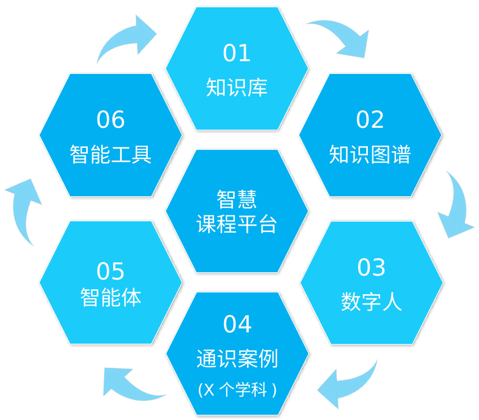

# AI 通识课程建设方案

 1+6+X 课程模式： 1 个智慧教育平台， 6 种课程资源， X 个学科方向的案例库。

# 智慧课程平台

• 智能建课• 智能备课课堂教学• 智慧实验• 智慧训练• 智能考试• 科研开发• 项目实战虚拟教研

# X 个学科方向案例

• 工学理学医学农学经管• 法教文史哲艺军事学

<html><body><table><tr><td>01知识库</td><td>课积表标库理量知识压/量化知识库开发</td></tr><tr><td>02 知识图谱</td><td>·课程知识结构化／跨课程／跨专业 学习路径规划／能力图谱/学情画像</td></tr><tr><td>03数字人</td><td>·个性化教学／沉浸式教学／交互式学习 数字分身／智能辅导／推理决策</td></tr><tr><td>04通识案例</td><td>·AI通识实验案例／体验案例／仿真案例/其 他 ·资源内嵌的智能学伴／助教／导师／专家</td></tr><tr><td>05 智能体</td><td>·感知／推荐／问答／学伴／规划／决策 深度思考／联网搜索／情景互动／开发部署</td></tr><tr><td>06 智能工具</td><td>试卷理解与识别／实践启发式助学／智能出题 智能备课／智能评阅／错题推送／智能助教</td></tr></table></body></html>